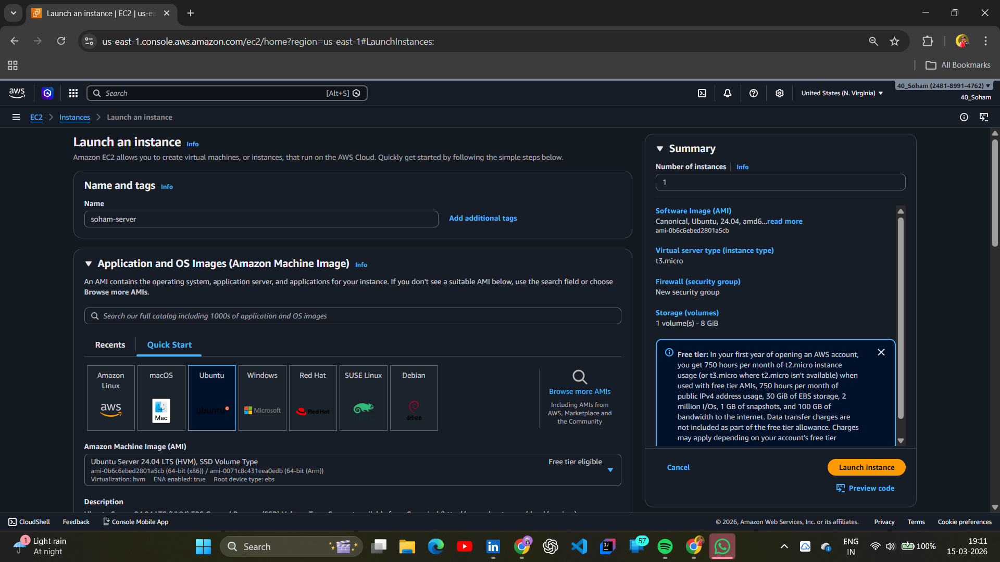
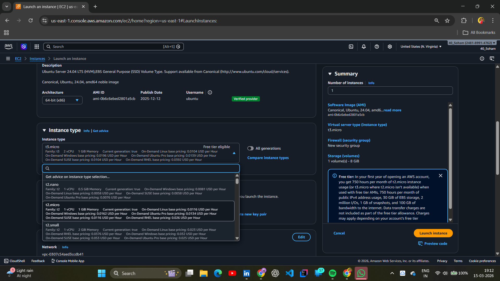
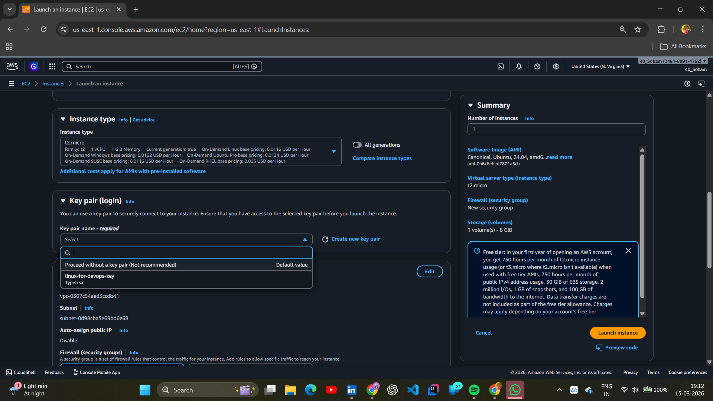
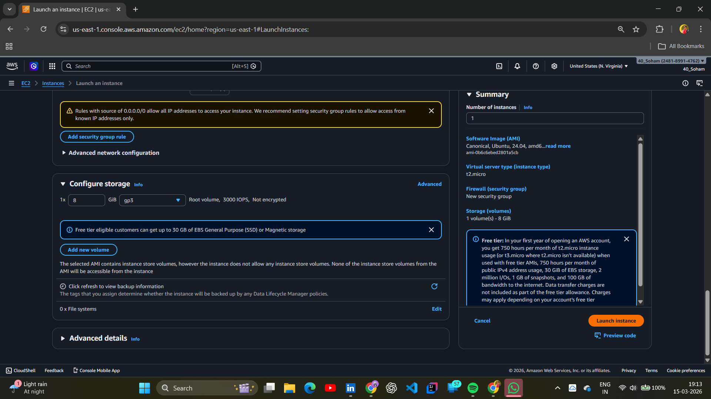
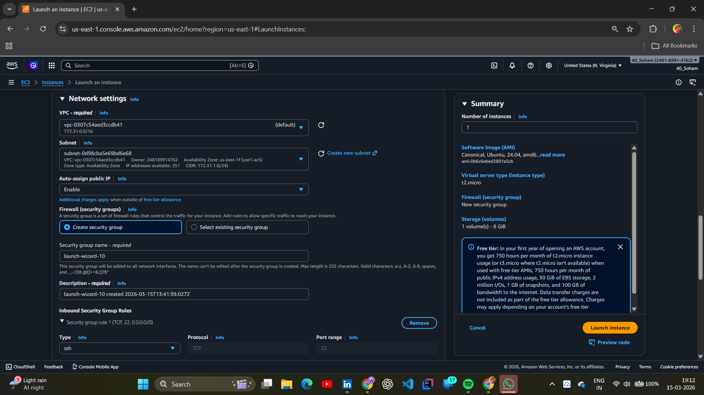
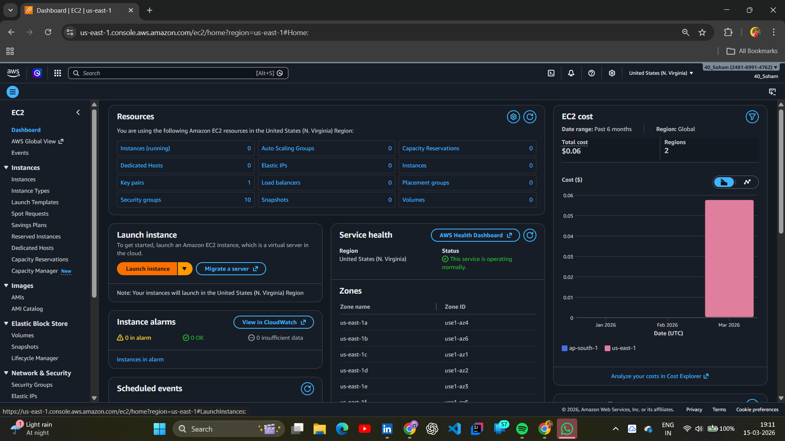
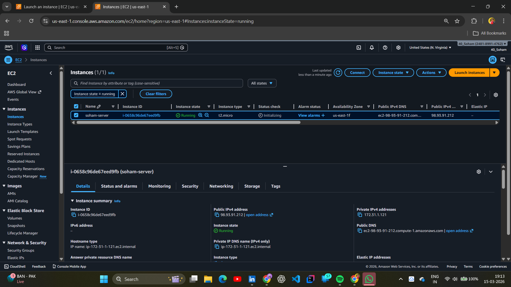

# 📂 Day 03: Virtualization & AWS EC2 Hands-on Lab

## 📖 Overview

On Day 03 of the **#100DaysOfDevOps** challenge, I moved from theoretical concepts to cloud implementation. I explored how **Virtualization** powers the modern cloud and manually provisioned my first Linux server using **AWS EC2**.

---

## 🏗️ Core Concepts: The Theory

Before jumping into the console, I learned the "How" behind the cloud:

- **The Hypervisor:** The software layer (VMware, Xen) that sits on physical hardware to create and manage Virtual Machines.
- **Logical Isolation:** Ensuring that multiple users can share the same physical server securely without seeing each other's data.
- **AWS Regions:** Understanding that the "Cloud" consists of physical data centers in locations like **Mumbai (ap-south-1)** and **Singapore**.

---

## 🛠️ Hands-on Lab: Provisioning an EC2 Instance

### 🚀 Step-by-Step Implementation

#### 1. OS Selection & Architecture

I chose **Ubuntu Server 22.04 LTS** as my Amazon Machine Image (AMI). This is the industry standard for most DevOps environments.

#### 2. Instance Type & Key Pair

Selected the **t2.micro** instance type to stay within the AWS Free Tier. I also generated a new **RSA Key Pair** to enable secure SSH access.

|                Instance Type                 |         Key Pair Creation          |
| :------------------------------------------: | :--------------------------------: |
|  |  |

#### 3. Storage & Security Configuration

Configured the root volume (8GiB gp3) and set up the **Security Group** (Virtual Firewall). I opened **Port 22** for SSH and **Port 80** for HTTP traffic.

|             Volume Config             |                 Security Group                 |
| :-----------------------------------: | :--------------------------------------------: |
|  |  |

#### 4. Final Launch & Verification

The instance was successfully launched and passed the status checks.

|           Launching Instance            |              Final Dashboard               |
| :-------------------------------------: | :----------------------------------------: |
|  |  |

---

## 🧠 Key Takeaways

- **Cloud Efficiency:** Virtualization allows us to "slice" hardware, reducing costs and waste.
- **Security First:** Key pairs provide much better security than traditional passwords.
- **Scalability:** I can now spin up a server in Mumbai in less than a minute.

---

_Follow my journey:_ [LinkedIn](https://www.linkedin.com/in/soham-sarkar-85a5a6247) | [GitHub](https://github.com/SohamSarkar025/100DaysOfDevOps)
