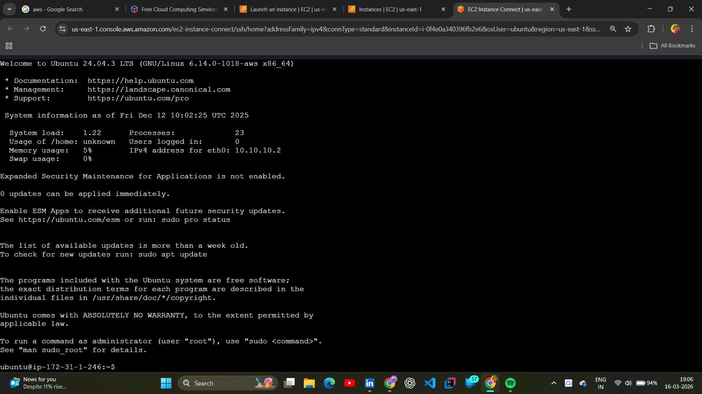
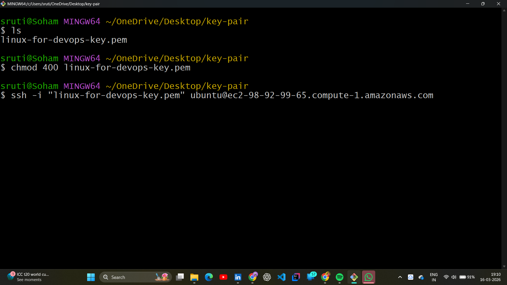
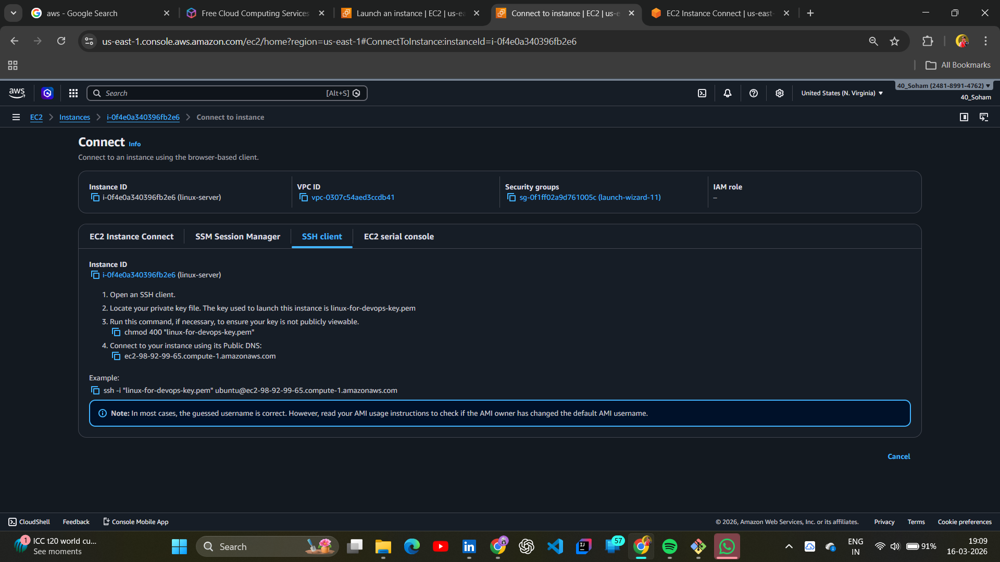
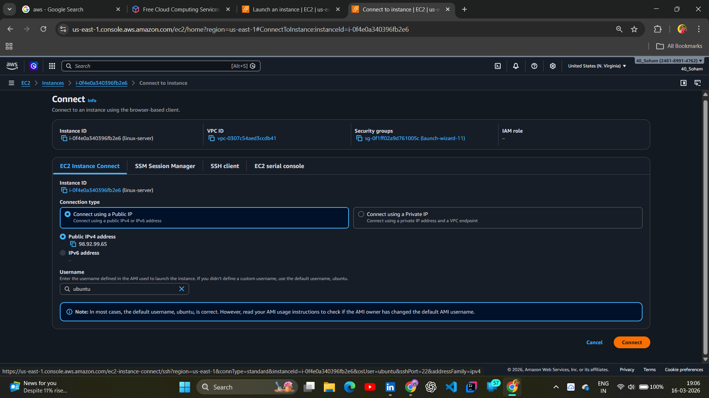
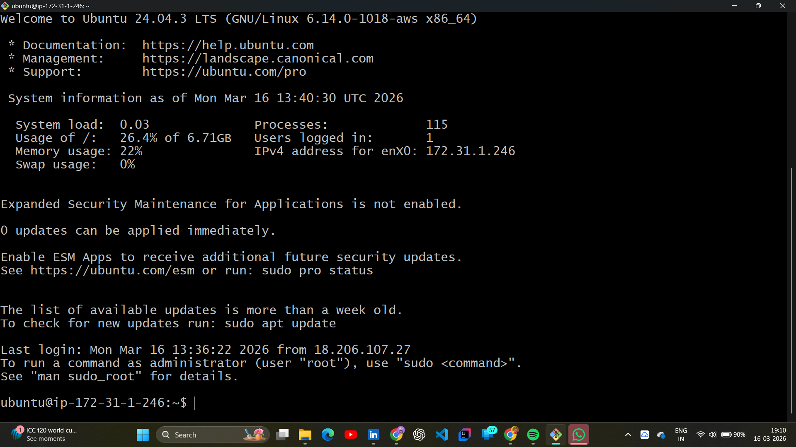

# 📂 Day 04: Connecting to EC2 (Instance Connect & Remote SSH)

## 📖 Overview

Provisioning a server is only the first step. On Day 04 of the **#100DaysOfDevOps** challenge, I focused on establishing secure communication channels with my Ubuntu instance. I explored the differences between browser-based access and the industry-standard **SSH (Secure Shell)** protocol via a local terminal (Git Bash).

---

## 🏗️ Connectivity Methods: The Theory

Before logging in, I learned how security layers protect cloud instances:

- **SSH (Secure Shell):** A cryptographic network protocol for operating network services securely over an unsecured network.
- **Port 22:** The standard gatekeeper for SSH traffic.
- **RSA Keys:** Understanding the Public Key (stored on AWS) and Private Key (stored on my local machine) handshake.

---

## 🛠️ Hands-on Lab: Establishing Connectivity

### 🚀 Step-by-Step Implementation

#### 1. Method 1: AWS EC2 Instance Connect

I first used the AWS native browser-based tool to verify the instance was reachable without any local configuration. It proved the server was healthy and the Security Group was functional.

#### 2. Method 2: Remote SSH via Git Bash

By using **Git Bash** on my Windows machine, I simulated a real-world Linux-to-Linux management environment. This is the primary way DevOps engineers manage production servers.

#### 3. Security Hardening & Connection

I applied the necessary permissions to my `.pem` key to prevent security errors and initiated the connection to the public IP.

|           Key Permission Setting (chmod)           |         The SSH Connection Command          |
| :------------------------------------------------: | :-----------------------------------------: |
|  |  |

#### 4. Successful Login & Verification

The connection was successful, providing me with a full terminal shell on the remote Mumbai-based Ubuntu server.

|           The EC2 Dashboard Status           |        Successful Ubuntu Shell Access        |
| :------------------------------------------: | :------------------------------------------: |
|  |  |

---

## 🧠 Key Takeaways

- **SSH Protocol:** Remote management is the heartbeat of DevOps; mastery of the terminal starts here.
- **Key Safety:** A private key is like a master key; if it's leaked or has "too open" permissions, the connection will be rejected for safety.
- **Troubleshooting:** Learned that "Connection Timed Out" usually points to a Security Group (Port 22) issue, while "Permission Denied" points to a Key Pair issue.

---

_Follow my journey:_ [LinkedIn](https://www.linkedin.com/in/soham-sarkar-85a5a6247) | [GitHub](https://github.com/SohamSarkar025/100DaysOfDevOps)
