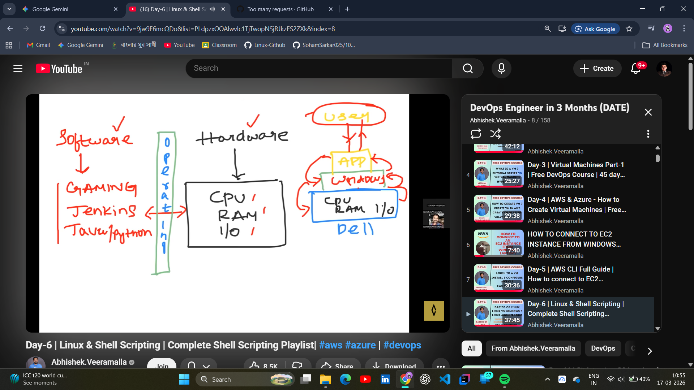
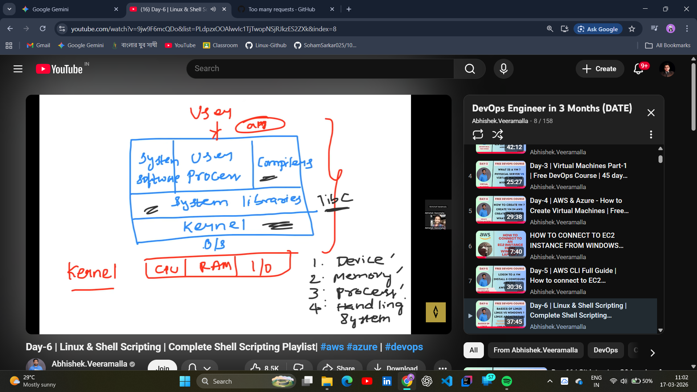
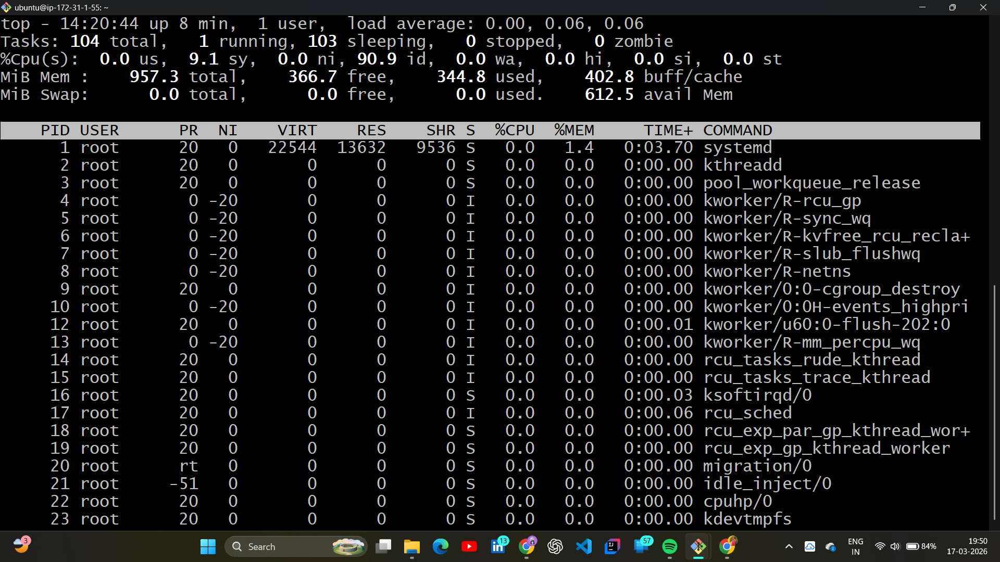

# 📂 Day 05: Linux Architecture & Command Line Fundamentals

## 📖 Overview
Linux is the industry standard for hosting cloud-native applications. On Day 05 of the **#100DaysOfDevOps** challenge, I explored the internal architecture of the Linux OS and mastered the essential commands required to navigate, manage, and monitor a remote server.

---

## 🏗️ Linux Architecture: The Core Logic
Understanding how the OS manages hardware is vital for troubleshooting and performance tuning.

* **Hardware:** Physical resources like CPU, RAM, and Disk.
* **Kernel:** The heart of the OS that manages hardware resources via system calls.
* **Shell:** The command-line interpreter where we talk to the Kernel.
* **Application Space:** Where tools like Jenkins, Docker, or Nginx live.

| Operating System Logic | Linux Layered Architecture |
| :---: | :---: |
|  |  |

---

## 🛠️ Hands-on Lab: Navigation & Monitoring

### 1. File System Navigation
I practiced moving through the directory tree, understanding the difference between absolute and relative paths using the CLI.

- **`pwd`**: Print Working Directory.
- **`ls`**: List directory contents.
- **`cd`**: Change directory to navigate the file system.

### 2. System Resource Monitoring
As a DevOps engineer, you must know how to audit server health. I used these commands to check the EC2 instance's live performance:

| Resource | Command | Key Metric Monitored |
| :--- | :--- | :--- |
| **RAM** | `free -m` | Total vs. Available memory |
| **CPU** | `nproc` | Number of processing cores |
| **Disk** | `df -h` | Human-readable storage usage |
| **Processes** | `top` | Live task manager for Linux |

**Lab Evidence:**
| Basic Navigation & Disk Check | Real-time Process Monitoring |
| :---: | :---: |
| .png) |  |

---

## 🧠 Key Takeaways
* **Kernel Management:** The Kernel acts as the gatekeeper for hardware access.
* **CLI Power:** Using the terminal is significantly faster and more reliable for server management than a GUI.
* **Observability:** Commands like `top` and `df -h` provide instant visibility into system bottlenecks.

---
*Follow my journey:* [LinkedIn](https://www.linkedin.com/in/soham-sarkar-85a5a6247) | [GitHub](https://github.com/SohamSarkar025/100DaysOfDevOps)
