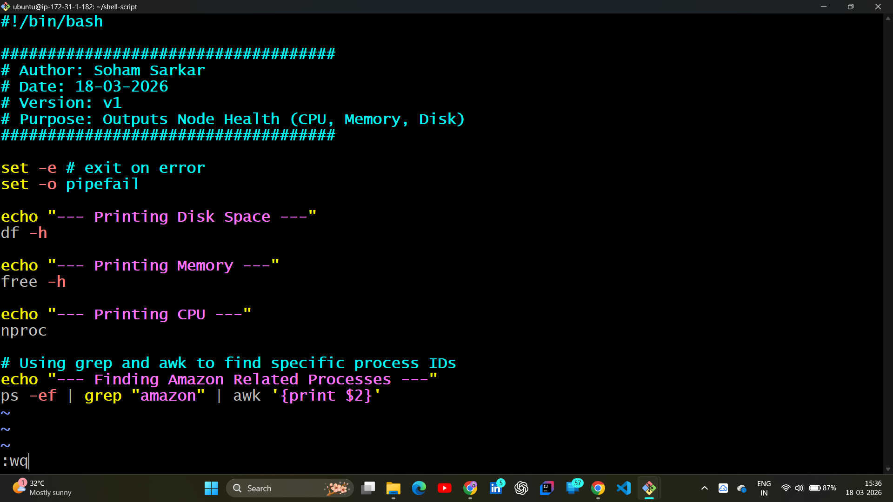
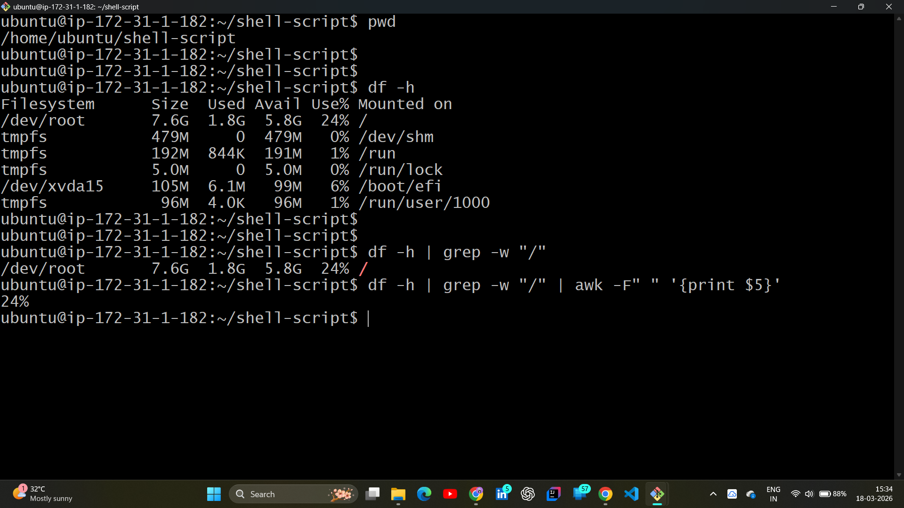
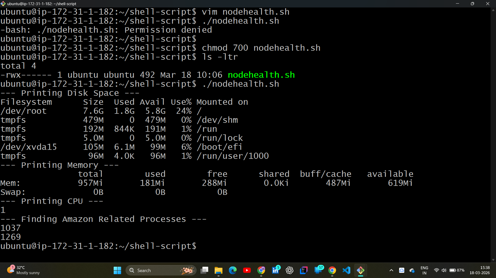

# 📂 Day 06: Shell Scripting Zero to Hero (Part 1 & 2)

## 📖 Overview
On Day 06 of the **#100DaysOfDevOps** challenge, I pivoted from manual Linux commands to **Automation**. I learned how to bundle commands into executable scripts, handle permissions, and use powerful text-processing tools like `grep` and `awk` to audit system health.

---

## 🏗️ The Core of Scripting: Theory
Before automating, I understood the "Why" and "How" of production-grade scripts:

* **The Shebang (`#!`):** Telling the OS which interpreter to use (`/bin/bash`).
* **Debug Mode (`set -x`):** Prints commands before execution to trace logic.
* **Fail-Safe Logic:** Using `set -e` and `set -o pipefail` to stop the script if any command fails.

| Script Safety Flags | Purpose |
| :--- | :--- |
| **`set -x`** | Debug mode for troubleshooting |
| **`set -e`** | Exit immediately on command failure |
| **`set -o pipefail`** | Catch errors hidden inside pipelines |

---

## 🛠️ Hands-on Lab: Building a Node Health Script

### 1. Script Initialization
I created `nodeHealth.sh` to automate the monitoring of server resources. This script replaces manual checks with a single execution, ensuring consistency across environments.

**Lab Evidence:**

### 2. ✂️ Text Processing & Filtering
Real automation requires extracting specific data from large outputs. I practiced using pipes (`|`) to combine commands:

* **`grep`**: Pattern matching to find specific lines in logs or process lists.
* **`awk`**: Advanced column manipulation to extract specific data points.

**Lab Evidence:**

---

## 🔐 Permission Management (`chmod`)
A script cannot protect or run itself without the right permissions. I explored how to manage access levels to ensure security and execution:

* **`chmod 777`**: Full access (⚠️ **Avoid in production!**).
* **`chmod 700`**: Private; only the owner can read/write/execute.
* **`chmod +x script.sh`**: The standard way to make a script runnable.

**Lab Evidence:**

---

## 🧠 Key Takeaways
* **Efficiency:** Automation scales—a script can check 1,000 servers as easily as one.
* **Reliability:** Fail-safe flags prevent scripts from running "blindly" when errors occur.
* **Tooling:** `grep` and `awk` are the "bread and butter" of log analysis and system monitoring.

---
*Follow my journey:* [LinkedIn](https://www.linkedin.com/in/soham-sarkar-85a5a6247) | [GitHub](https://github.com/SohamSarkar025/100DaysOfDevOps)
