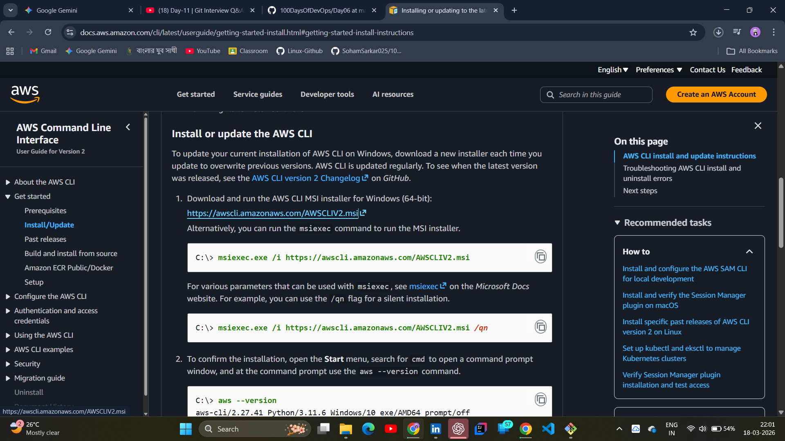
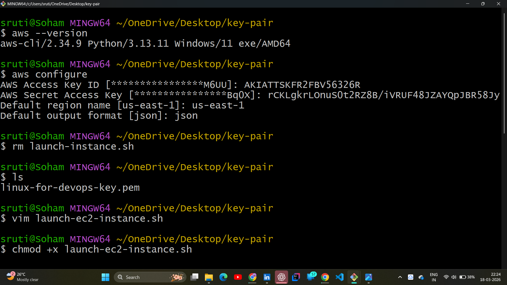
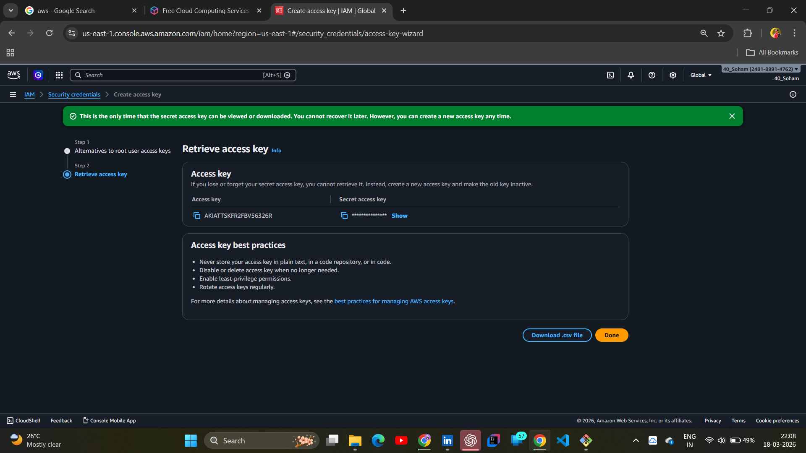
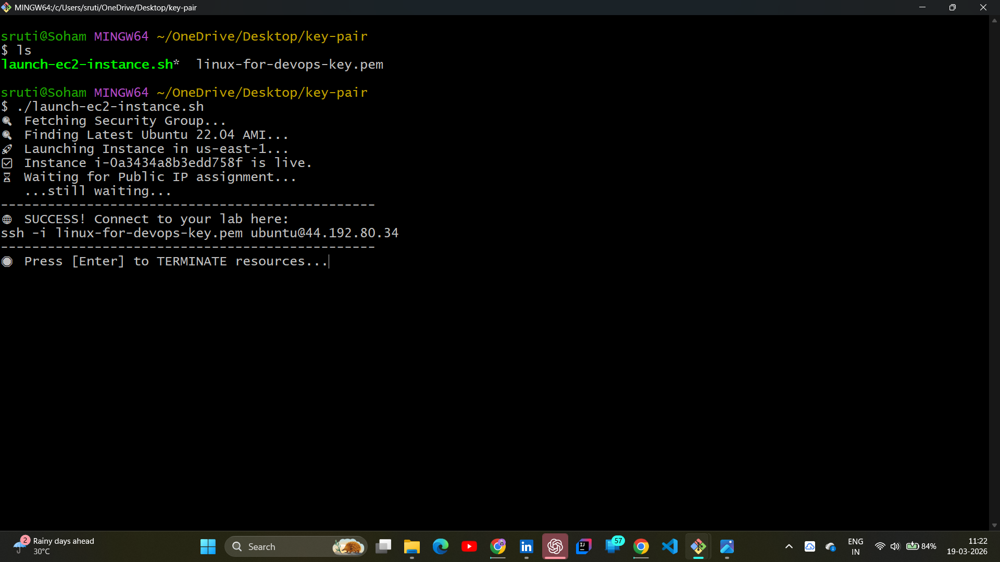
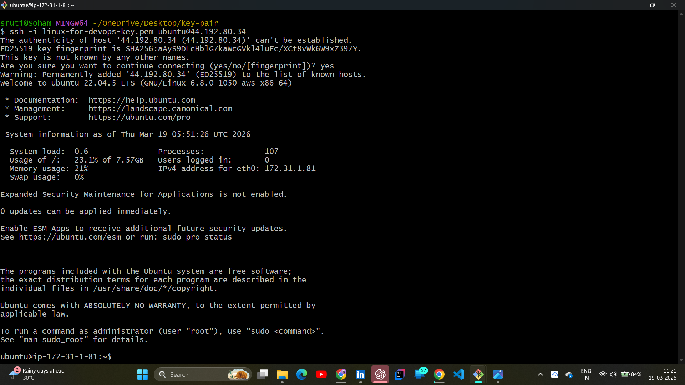
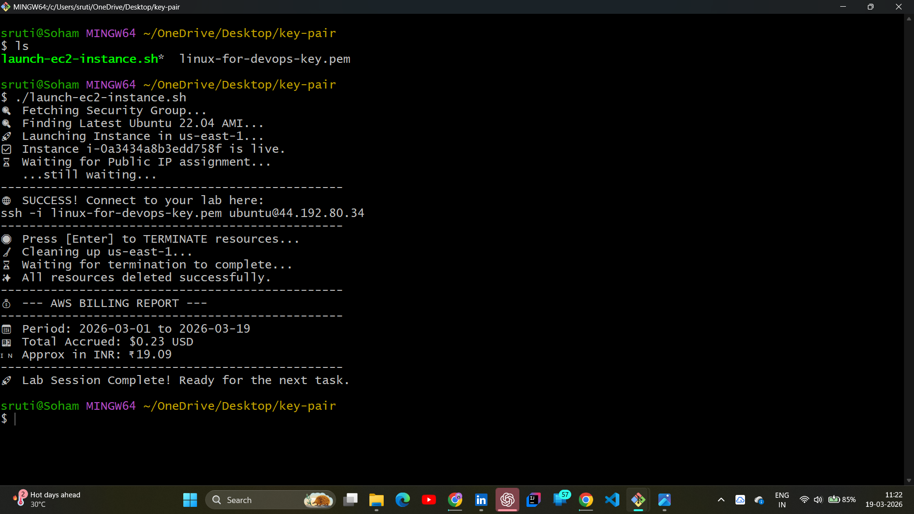

# 📂 Day 07: Optimizing the Lab Lifecycle (Zero-Console Strategy)

## 📖 Overview
The **Main Funda** for Day 07 was simple: **Kill the UI Bottleneck.** Clicking through the AWS Console for every lab is a massive time-sink. Today, I finalized a "Single-Command" lifecycle script in **Git Bash** that handles everything from Provisioning to Termination and Billing analysis.

---

## 🏗️ The Logic: GUI vs. CLI Automation
In DevOps, speed and repeatability are everything. Moving the lab workflow to a script achieves three goals:
1. **Zero Manual Error:** No more picking the wrong AMI or forgetting to enable a Public IP.
2. **Extreme Speed:** Reduced a 5-minute manual process to under 30 seconds.
3. **Integrated FinOps:** The billing report prints *automatically* upon termination.

| Manual Step (AWS Console) | Automated Step (Bash Script) | Time Saved |
| :--- | :--- | :--- |
| **Launch Instance** | `aws ec2 run-instances` | ~2 Mins |
| **Fetch Public IP** | `Smart-Wait While Loop` | ~1 Min |
| **SSH Connection** | `ssh ubuntu@<IP>` | ~30 Secs |
| **Check Billing** | `aws ce get-cost-and-usage` | ~2 Mins |

---

## 🔐 Infrastructure & Authentication Prerequisites
Before running the automation, the following environment must be set up:

* **AWS CLI in Git Bash:** Configured via `aws configure` using **Root Access Keys** for full resource control.
* **VPC & Networking:** A VPC with a Subnet ID that allows Public IP assignment.
* **Security Group:** An active SG with **Inbound Port 22 (SSH)** open.
* **Identity:** A valid `.pem` key-pair file stored in the local directory.

---

## 🛠️ Hands-on Lab: The Lifecycle Automator

### 1. The Secure Handshake (Configuration)
To bridge my local machine and the cloud, I authenticated my Git Bash terminal. This "Cockpit" setup allows me to manage global resources without ever logging into a browser.

**Lab Evidence:**
| CLI Download | AWS Configure | Access Key Management |
| :---: | :---: | :---: |
|  |  |  |

### 2. End-to-End Execution
My script automates the entire "Launch-to-Delete" cycle. It polls the API for the Public IP, connects via SSH, and provides a formatted billing report in both **USD** and **INR** upon termination.

**Lab Evidence:**
| Script Launch | SSH Connection | Script Termination & Billing |
| :---: | :---: | :---: |
|  |  |  |

---

## 🧠 Key Takeaways
* **DevOps is Efficiency:** If you do it more than twice, automate it.
* **API > GUI:** Talking directly to the AWS API is more reliable than clicking buttons.
* **FinOps Awareness:** Seeing the **₹18.35 ($0.20)** cost instantly after the lab keeps me budget-conscious.
* **Security Responsibility:** While using Root keys for speed, I understand the importance of protecting these credentials in a production environment.

---
*Follow my journey:* [LinkedIn](https://www.linkedin.com/in/soham-sarkar-85a5a6247) | [GitHub](https://github.com/SohamSarkar025/100DaysOfDevOps)
