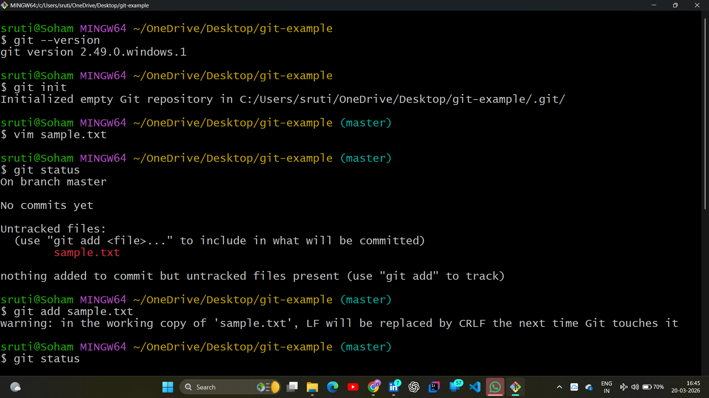
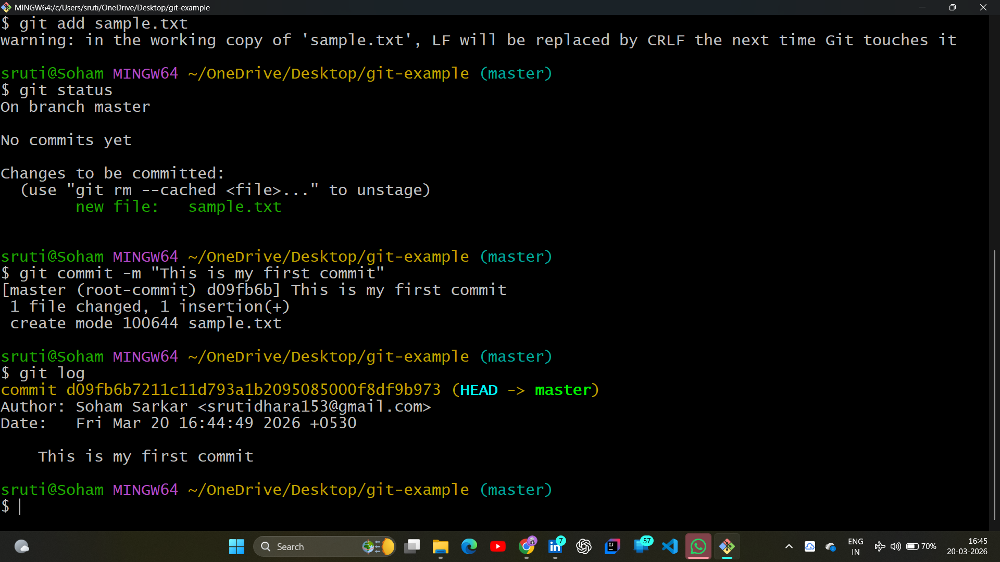

# 📂 Day 08: Version Control with Git & GitHub

## 📖 Overview
On Day 08 of the **#100DaysOfDevOps** challenge, I moved from local scripting to **Version Control**. Understanding how to track changes, revert to previous versions, and collaborate using Git is the "Time Machine" every DevOps Engineer needs to manage infrastructure as code.

---

## 🏗️ Version Control System (VCS) Logic
VCS allows multiple developers to work on the same codebase without overwriting each other's work.

* **Centralized VCS:** A single central server; if the server goes down, history is lost.
* **Distributed VCS (Git):** Every developer has a full copy of the repository. This is the industry standard for high-availability DevOps environments.

| Concept | Purpose |
| :--- | :--- |
| **Sharing** | Moving code between local machines and cloud platforms like GitHub |
| **Versioning** | Tracking snapshots to allow easy rollbacks to working versions |
| **Integrity** | Using unique Hash IDs to ensure every change is accounted for |

---

## 🛠️ Hands-on Lab: The Git Workflow

### 1. Initialization & Initial Status
I initialized my project directory to start tracking changes. This creates the hidden `.git` folder—the "brain" of the repository. I used `git status` to identify untracked files before moving them to the staging area.

**Lab Evidence:**
| Git Init & Initial Status |
| :---: |
|  |

### 2. Staging, Committing & History
I moved my script from the working directory to the **Staging Area** (`git add`) and then took a permanent snapshot in the **Local Repository** (`git commit`). Finally, I audited the commit logs to verify the unique Hash ID and author details.

**Lab Evidence:**
| Add, Commit & Log History |
| :---: |
|  |

---

## 🧠 Key Takeaways
* **The "Time Machine" Effect:** Every commit is an immutable point in time. If a script fails, I can jump back instantly.
* **Distributed Resilience:** Because Git is distributed, my local machine is a full backup of the entire project history.
* **Collaboration Foundation:** This setup is the first step toward building CI/CD pipelines and working in team environments.

---
*Follow my journey:* [LinkedIn](https://www.linkedin.com/in/soham-sarkar-85a5a6247) | [GitHub](https://github.com/SohamSarkar025/100DaysOfDevOps)
