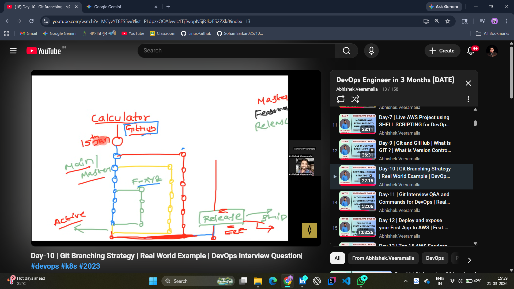
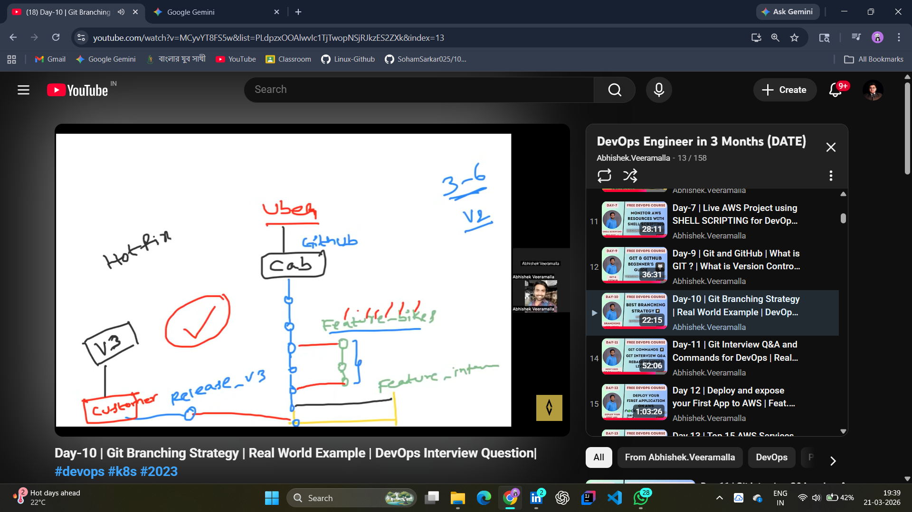

# 📂 Day 09: Git Branching Strategy (The DevOps Standard)

## 📖 Overview
On Day 09, I transitioned from simple versioning to **Branching Strategies**. In a professional DevOps environment, we never push code directly to the `main` branch. We use branching to separate "Feature Development," "Testing," and "Production Releases."

---

## 🏗️ The Logic: Why do we need Branching?
Imagine a company like **Uber**. They have thousands of developers. If everyone worked on the same branch, the app would crash every minute.

* **Main/Master Branch:** The "Holy Grail." Only stable, production-ready code lives here.
* **Feature Branches:** Where developers build new things (e.g., `feature-bikes` or `feature-intercity`).
* **Release Branches:** A snapshot of code being prepared for the customer (`Release_v3`).
* **Hotfix Branches:** Temporary branches created to fix critical bugs in production immediately.

---

## 🛠️ Hands-on Lab: Real-World Example (The Calculator App)

I used the **Calculator App** logic to understand how multiple versions (v1, v2) and features (Add, Sub, Mul, Div) are managed simultaneously.

### 1. Feature Separation
I practiced creating isolated branches for specific features. This ensures that a bug in the "Division" logic doesn't stop the "Addition" feature from working for the customer.

### 2. The Release Lifecycle
I mapped out the journey of code from a developer's local machine to a **Release** branch, and finally to the **Customer**. This is the foundation of the CI/CD pipeline.

**Lab Evidence:**
| Git Branching Logic | Real-World Workflow (Uber Example) |
| :---: | :---: |
|  |  |

---

## 🧠 Key Takeaways
* **Isolation is Key:** Branching allows multiple developers to work on different features (Dev1, Dev2) without conflict.
* **Release Management:** A `Release_v3` branch ensures we can fix bugs for the current version while still developing `v4` on the `main` branch.
* **DevOps Responsibility:** As a DevOps Engineer, I must ensure the **Branching Strategy** is followed to maintain code integrity and deployment frequency.

---
*Follow my journey:* [LinkedIn](https://www.linkedin.com/in/soham-sarkar-85a5a6247) | [GitHub](https://github.com/SohamSarkar025/100DaysOfDevOps)
