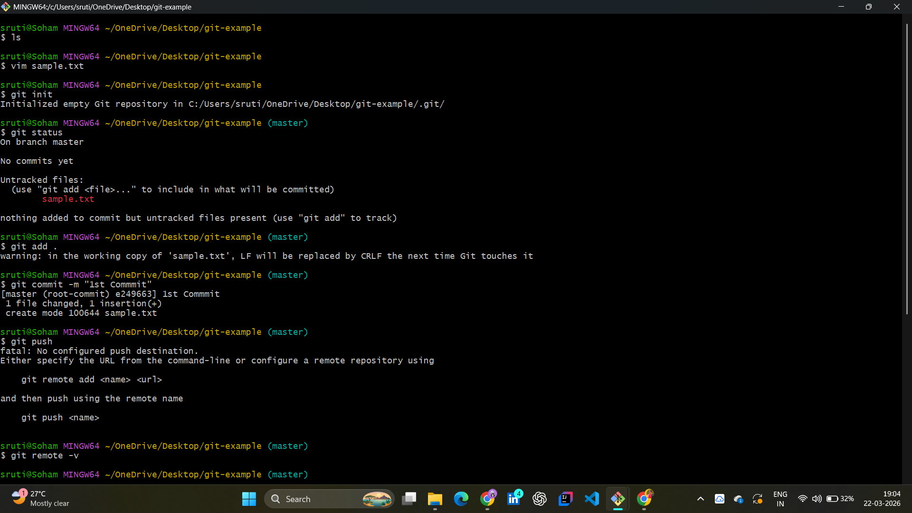
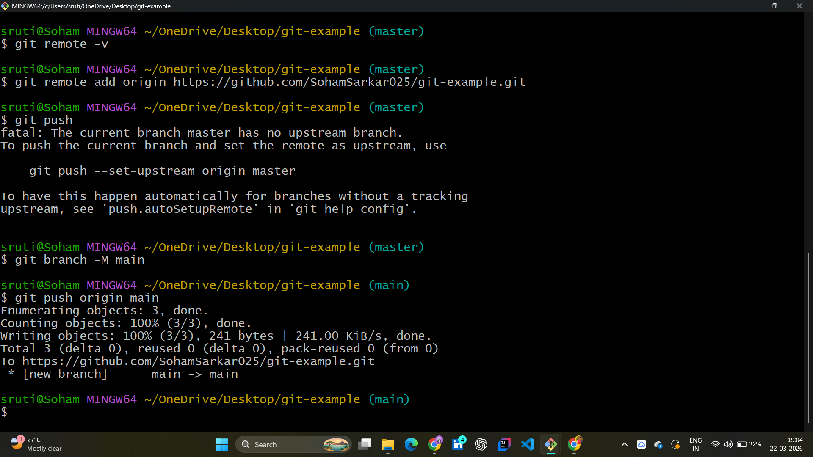
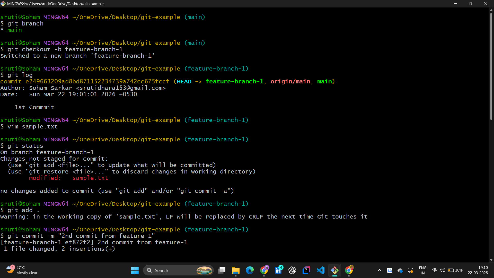
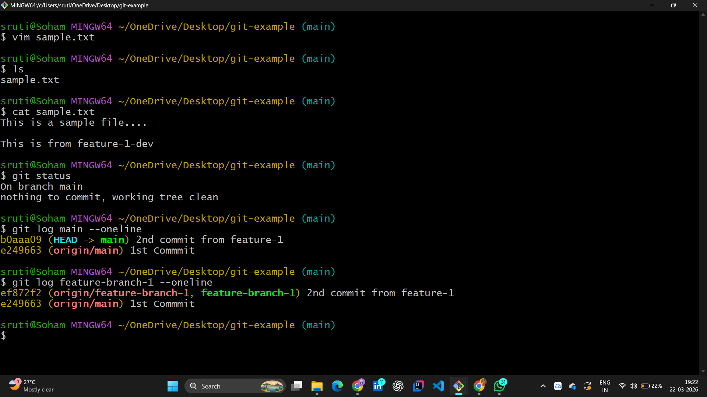
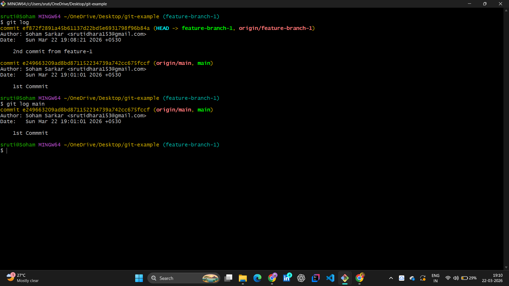
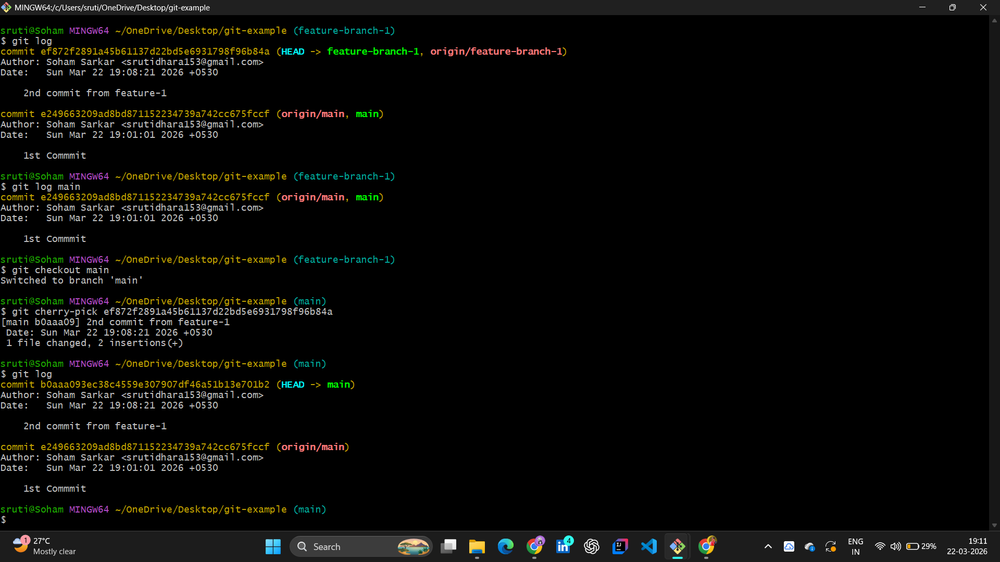
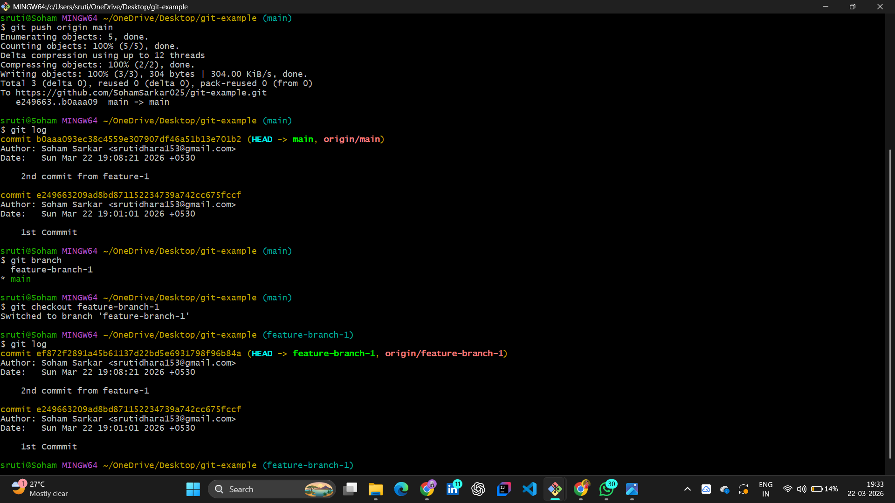

# 📂 Day 10: Advanced Git Workflows — Connectivity & Surgical Commits

## 📖 Overview

Day 10 was a major milestone in my **#100DaysOfDevOps** journey. I moved beyond local version control to master **Remote Collaboration** and **Surgical Code Management**. These skills are the backbone of CI/CD pipelines and professional software engineering.

---

## 🏗️ The Remote Lifecycle

In DevOps, the local repository is a sandbox, but the **Remote (GitHub)** is the "Source of Truth."

| Command             | Action              | Purpose                                                |
| :------------------ | :------------------ | :----------------------------------------------------- |
| `git remote add`    | Link local to Cloud | Establishing the Upstream connection.                  |
| `git push`          | Upload commits      | Synchronizing local work with the team.                |
| `git log --oneline` | Audit History       | Viewing a clean, traceable path of commits.            |
| `git cherry-pick`   | Surgical Merge      | Applying a specific commit from one branch to another. |

---

## 🛠️ Hands-on Lab: From Connectivity to Surgery

### 1. Initializing & Linking Remotes

I initialized the repository and practiced the "Handshake" with GitHub. I encountered and resolved the `fatal: No configured push destination` error—a critical learning moment for understanding how Git tracks remote branches.

**Lab Evidence:**
| Git Initialization | Remote Add & First Push |
| :---: | :---: |
|  |  |

### 2. Feature Branching & Auditing

To maintain a stable `main` branch, I practiced **Feature Isolation**. By using `git branch`, I developed new logic without risking the production code. I used the `--oneline` flag to manage commit hashes efficiently.

**Lab Evidence:**
| Feature Branching | Git Log Audit |
| :---: | :---: |
|  |  |

### 3. Advanced Strategy: Cherry-Picking

This was the most advanced part of the lab. Instead of a standard merge (which brings all changes), I used `git cherry-pick` to grab only the **Add Division** logic from my feature branch and move it to `main`. This is essential for pushing hotfixes in a production environment.

**Lab Evidence:**
| Pre-Merge State | Cherry-Pick & Merge Success | Final Cloud Sync |
| :---: | :---: | :---: |
|  |  |  |

---

## 🧠 Key Takeaways

- **Surgical Precision:** `git cherry-pick` prevents "code leakage" by only moving what is ready.
- **History Integrity:** A clean, linear history (via oneline logs) makes troubleshooting production bugs 10x faster.
- **Cloud Synchronization:** Mastering the local-to-remote "Push" ensures that the deployment pipeline always has the latest stable code.

---

## 🤝 Connect with Me

 | 

_"DevOps is about building bridges between code and the customer."_
