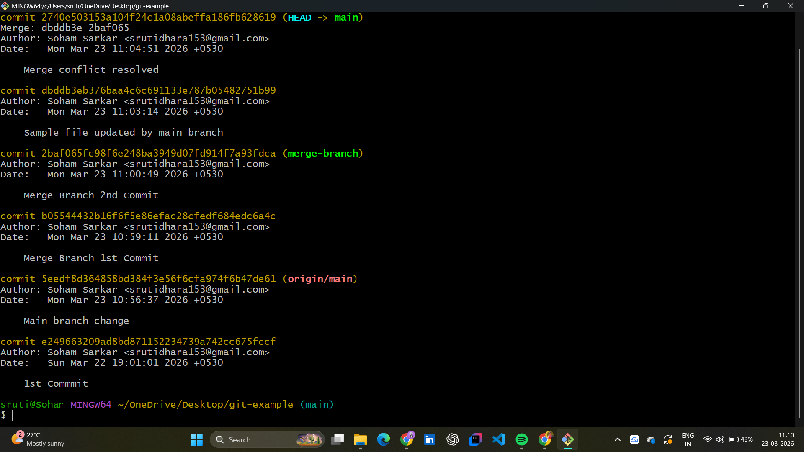
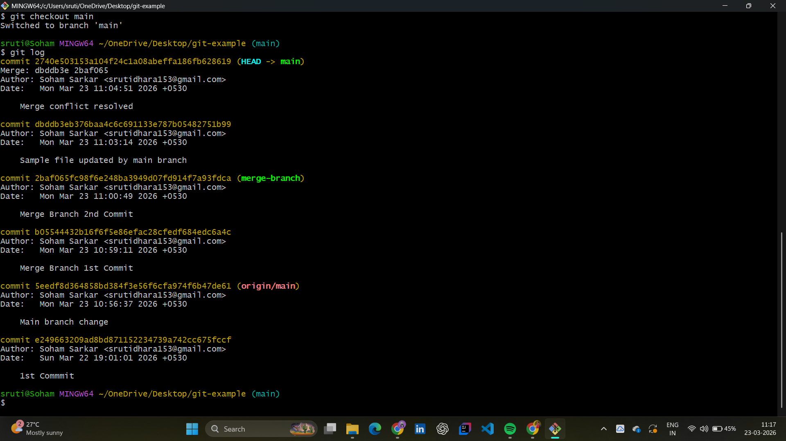
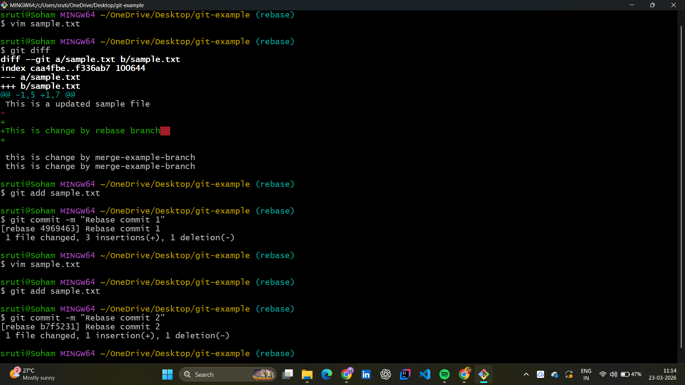
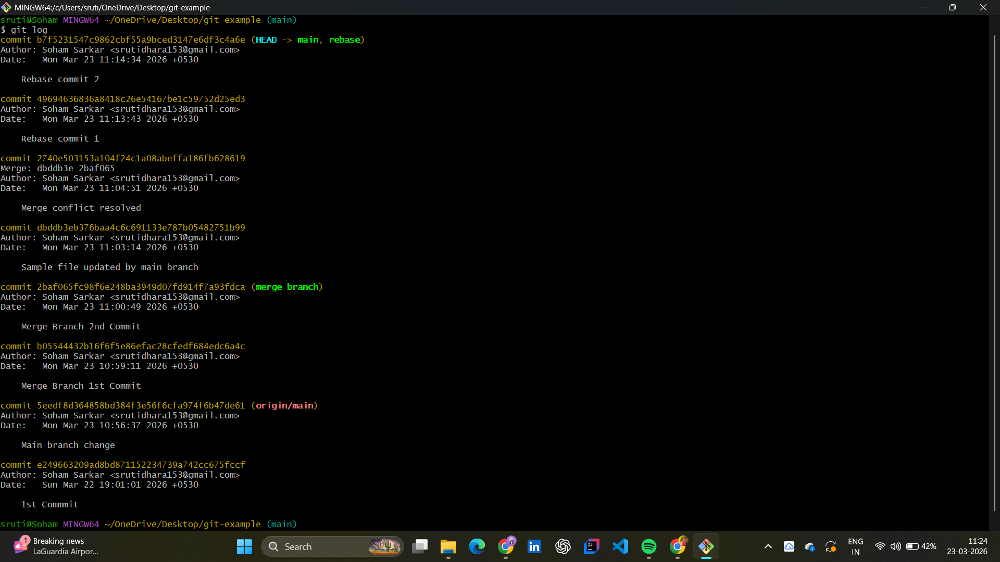

# 📂 Day 11: Git Conflict Resolution, Rebase & History Recovery

## 📖 Overview
On Day 11, I tackled the "Chaos Management" side of DevOps. In a fast-paced team, overlapping code changes are inevitable. Today, I mastered how to manually resolve those overlaps and the critical architectural difference between **Merging** and **Rebasing**.

---

## 🏗️ The Integration Debate: Merge vs. Rebase
I explored the two primary ways to incorporate feature work into the main codebase.

| Strategy | Logic | Result |
| :--- | :--- | :--- |
| **Git Merge** | Joins branches with a new "Merge Commit". | Non-linear history; preserves full context. |
| **Git Rebase** | Moves feature commits to the tip of main. | **Linear History**; cleaner and easier to debug. |

---

## 🛠️ Hands-on Lab: Conflict & Resolution

### 1. Manual Conflict Resolution
I deliberately created a conflict in my `sample.txt` file by modifying the same lines on different branches. I manually edited the file to remove Git's markers (`<<<<<<<`, `=======`, `>>>>>>>`) and finalized the integration.

**Lab Evidence:**
* **Merge Success:** 
* **Branch Audit:** 

### 2. Mastering the Linear History (Rebase)
To achieve a professional-grade log, I used `git rebase` to move my development commits. This eliminated the "spaghetti" history and created a single, traceable line of progress.

**Lab Evidence:**
* **Rebase Process:** 
* **Linear Log Result:** 

### 3. "Time Travel" & Troubleshooting (Reset & Force)
I practiced recovering from mistakes using `git reset --hard`.
* **The Challenge:** Resetting locally made my history "behind" GitHub, causing a `non-fast-forward` error.
* **The Fix:** I used `git push origin main --force` to synchronize the remote repository with my clean local state.

---

## 🧠 DevOps "SME" Key Takeaways
* **Linearity is King:** A clean history (via Rebase) makes it 10x easier to find where a production bug was introduced using `git bisect`.
* **The Golden Rule:** Never Rebase on shared public branches. Always "Rebase locally, Merge globally."
* **Force with Caution:** `--force` is a powerful tool for cleaning personal repos but must be used with extreme care in a team environment.

---
## 🤝 Connect with Me
 | 

*"In DevOps, we don't fix mistakes; we use version control to prevent them from ever happening again."*
