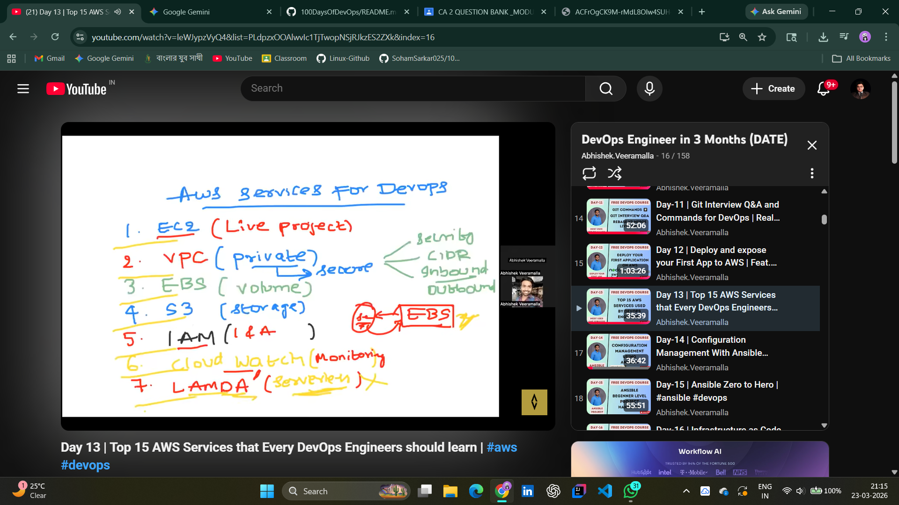
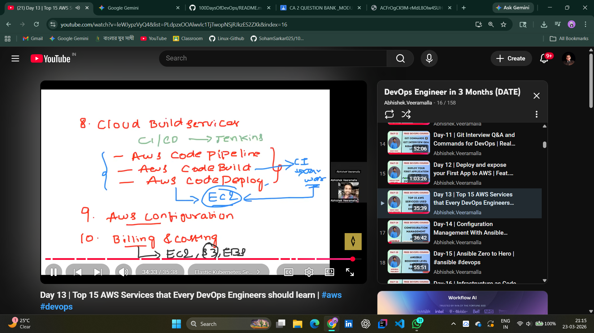
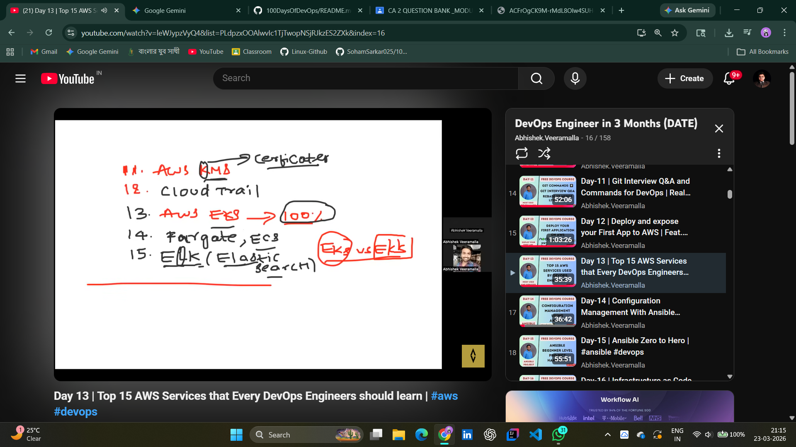

# 📂 Day 12: Top 15 AWS Services for DevOps Engineers

## 📖 Overview

On Day 12, I shifted focus from Version Control to **Cloud Infrastructure**. Understanding the AWS ecosystem is mandatory for any DevOps Engineer. Today’s lab involved breaking down the 15 most essential services used to build, deploy, and monitor scalable applications.

---

## 🏗️ AWS Service Categorization

I’ve categorized these services based on their functional role in a standard CI/CD and Infrastructure-as-Code (IaC) workflow.

### 1. Compute & Networking (The Foundation)

- **EC2 (Elastic Compute Cloud):** Virtual servers for application hosting.
- **VPC (Virtual Private Cloud):** Isolated network environments. Mastered **CIDR**, **Subnets**, and **Security Groups**.
- **EBS (Elastic Block Store):** Persistent block storage for EC2 instances.

### 2. Storage & Content Delivery

- **S3 (Simple Storage Service):** Industry-standard object storage for backups and static assets.
- **AWS Certificate Manager (ACM):** Handling SSL/TLS for secure communication.

### 3. Identity & Security (I&A)

- **IAM (Identity & Access Management):** The backbone of AWS security. Practiced the "Principle of Least Privilege."
- **AWS KMS:** Managing encryption keys for data at rest.

### 4. Monitoring & Governance

- **CloudWatch:** Real-time monitoring of resources and logs.
- **CloudTrail:** Auditing user activity and API calls for compliance.
- **AWS Config:** Assessing and auditing resource configurations.

### 5. Deployment & Serverless

- **AWS CodePipeline/Build/Deploy:** Native CI/CD suite for automated deployments.
- **Lambda:** Running code without managing servers (Serverless).
- **Billing & Cost Management:** Essential for FinOps to avoid unexpected cloud spend.

### 6. Modern Application Stack

- **EKS (Elastic Kubernetes Service):** Managed K8s for container orchestration.
- **ECS & Fargate:** Container management and serverless container execution.
- **Amazon OpenSearch (ELK):** Search and log analytics.

---

## 🛠️ Hands-on Lab: Architectural Mapping

I mapped how these services interact in a real-world scenario:

1. User hits a **VPC** via a secure **ACM** certificate.
2. Traffic flows to an **EC2** instance backed by **EBS**.
3. Logs are sent to **CloudWatch** for monitoring.
4. Deployment is automated via **CodePipeline**.

**Lab Evidence:**

- **Service Mapping 01:** 
- **Service Mapping 02:** 
- **Service Mapping 03:** 

---

## 🧠 DevOps "SME" Key Takeaways

- **Automation is Key:** These services aren't just for manual use; they are targets for **Terraform** and **Ansible**.
- **Security First:** Never use the Root user; always use IAM roles for EC2-to-S3 communication.
- **Cost Awareness:** Always check **Billing & Cost Management** after a lab to ensure no stray resources are running.

---

## 🤝 Connect with Me

 | 
