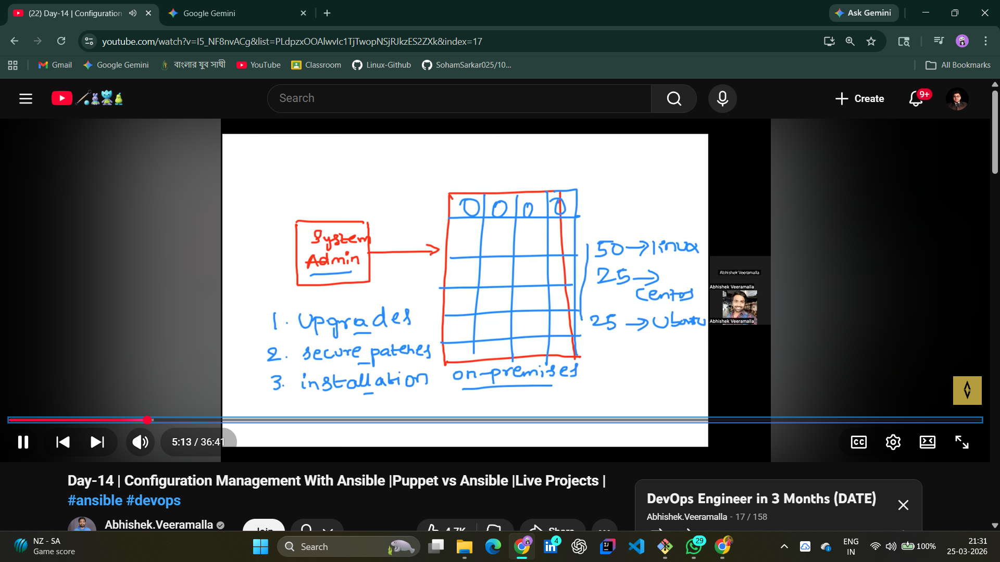
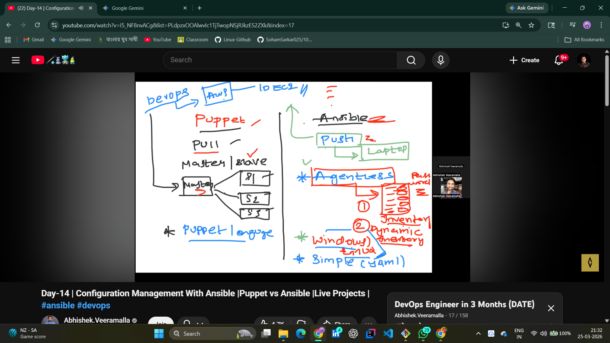
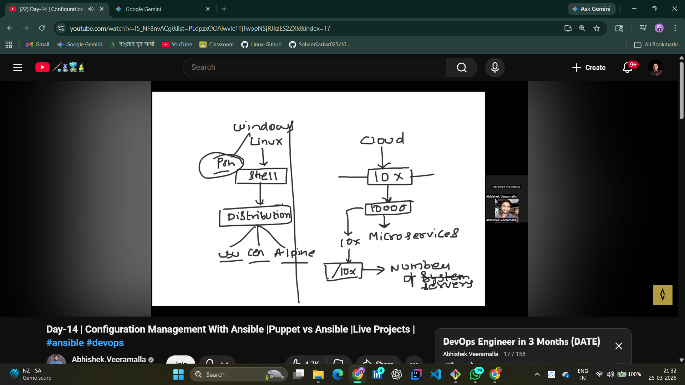

# 📂 Day 13: Configuration Management & Ansible Fundamentals

## 📖 Overview
On Day 13, I transitioned from manual cloud management to **Automated Configuration Management (CM)**. As a DevOps Engineer, scalability is key. I explored why tools like **Ansible** are preferred over traditional shell scripting for managing fleet-level infrastructure.

---

## 🏗️ What is Configuration Management?
In a microservices architecture, managing servers manually (one by one) is impossible. CM tools allow us to:
1. **Standardize:** Ensure every server has the exact same version of Java, Python, or Nginx.
2. **Automate:** Perform upgrades, security patches, and installations across 10, 100, or 1000+ servers simultaneously.
3. **Idempotency:** The ability to run a script multiple times without changing the result if the system is already in the desired state.

---

## ⚔️ The Great Debate: Puppet vs. Ansible
I analyzed the architectural differences between "Push" and "Pull" models.

| Feature | Puppet / Chef | Ansible |
| :--- | :--- | :--- |
| **Model** | **Pull:** Agent software pulls from Master. | **Push:** Controller pushes to nodes. |
| **Architecture** | Master-Slave (Complex) | **Agentless (Simple)** |
| **Language** | Ruby / DSL | **YAML (Human Readable)** |
| **Communication** | Constant Heartbeat | **SSH (Linux) / WinRM (Windows)** |

---

## 🛠️ Hands-on Lab: Understanding the Ansible Ecosystem
I mapped out the core components that make Ansible the most popular CM tool today:

1. **Control Node:** My local machine or an EC2 instance where Ansible is installed.
2. **Managed Nodes:** The target servers (AWS/Azure/On-premise) that we want to configure.
3. **Inventory:** A simple file containing the list of IP addresses of our managed nodes.
4. **Modules:** Small Python programs that execute specific tasks (e.g., `apt`, `yum`, `service`).
5. **Ansible Galaxy:** The "App Store" for DevOps, providing pre-written roles.

**Lab Evidence:**
* **CM Philosophy:** 
* **Agentless Workflow:** 
* **Scaling Strategy:** 

---

## 🧠 DevOps Interview Q&A
**Q: Why is Ansible called "Agentless"?**
**A:** Unlike Puppet or Chef, Ansible doesn't require any background software (Agent) to be installed on the target servers. It uses standard **SSH**, which is pre-installed on almost all Linux systems, making it lightweight and secure.

---
## 🤝 Connect with Me
 | 
