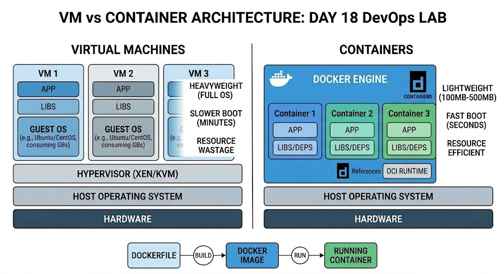

# 🐳 Day 18: Understanding Containerization with Docker

## 📖 Overview

After mastering Infrastructure as Code (IaC) with Terraform, today I transitioned to **Containerization**. I explored why the world is moving away from heavy Virtual Machines (VMs) and how Docker is revolutionizing application deployment.

---

## 🏗️ Virtualization vs. Containerization

### 1. The Problem with VMs (Virtual Machines)

In my study of Screenshot (204), I learned that VMs are "Heavyweight."

- Each VM requires a **Full Guest OS**, which consumes GBs of space.
- **Resource Wastage:** If a VM is allocated 8GB RAM but uses only 2GB, the rest is locked and wasted.
- **Slow Boot:** Initializing a full OS takes minutes.

.png>)

### 2. The Solution: Docker Containers

As seen in Screenshot (205) and (206), Containers are "Lightweight" because they share the **Host OS Kernel**.

- **Size:** Containers are usually **100MB - 500MB**, unlike VMs which are 2GB+.
- **Efficiency:** They only package the application, libraries, and dependencies.
- **Speed:** They start in seconds!

.png>)
.png>)

---

## 🛠️ The Docker Workflow

I mastered the core lifecycle of a Dockerized application (Screenshot 207 & 208):

1. **Dockerfile:** The blueprint/recipe containing instructions.
2. **Docker Image:** The static, executable package created after running `docker build`.
3. **Docker Container:** The final running instance of an image created via `docker run`.

.png>)
.png>)

_Unified Architectural Analysis: Comparing Virtual Machine (Heavyweight) vs Container (Lightweight) design._

---

## 📊 Quick Comparison Table

| Feature         | Virtual Machines (VM)   | Containers (Docker)        |
| :-------------- | :---------------------- | :------------------------- |
| **OS**          | Full Guest OS (Heavy)   | Shares Host Kernel (Light) |
| **Size**        | Gigabytes (GB)          | Megabytes (MB)             |
| **Performance** | High Overhead           | Near-native Performance    |
| **Isolation**   | Strong (Hardware level) | Process-level isolation    |

---

## 🛠️ Concepts Learned Today

- **Hypervisor (Xen/KVM):** The layer that creates VMs.
- **Docker Engine:** The software that manages containers.
- **OCI (Open Container Initiative):** Industry standards for container formats.

---

## 🤝 Connect with Me

 | 
