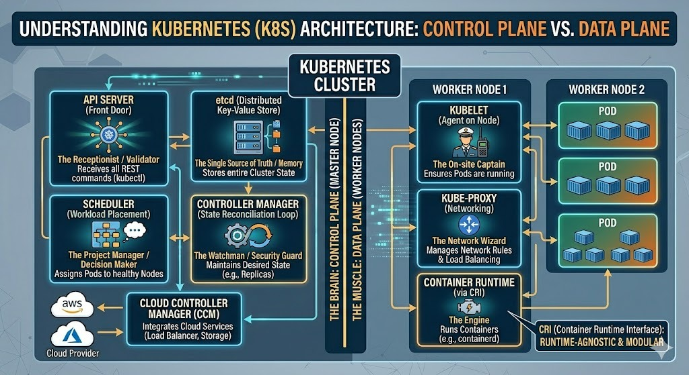

# ☸️ Day 26: Kubernetes Architecture — Control Plane & Data Plane

## 📖 Overview

Today's focus was the internal mechanics of a Kubernetes Cluster. Understanding how the **Master Node** communicates with **Worker Nodes** via the **API Server** and **Kubelet** is essential for troubleshooting production-grade clusters.

## 🏗️ The Cluster Architecture

Below is the visual breakdown of the Kubernetes components I mastered today:

---

## 🏗️ The Cluster Blueprint

### 1. Control Plane (The Brain)

The Control Plane makes global decisions about the cluster and detects/responds to cluster events.

- **API Server:** The "Front Door" for all communications. Every `kubectl` command hits this first.
- **etcd:** The cluster's "Memory." A distributed key-value store containing the entire state of the cluster.
- **Scheduler:** The "Project Manager." It decides which Worker Node should host a new Pod based on resource availability.
- **Controller Manager:** The "Watchman." It ensures the **Actual State** matches the **Desired State** (e.g., maintaining replica counts).

### 2. Data Plane (The Muscle)

This is where the actual workloads (Pods) reside.

- **Kubelet:** The "Agent" running on each node. It ensures that containers are running in a Pod and reports back to the API Server.
- **Kube-proxy:** The "Network Manager." It maintains network rules on nodes, allowing communication to your Pods from inside or outside the cluster.
- **Container Runtime:** The engine that runs the containers (e.g., `containerd`, `CRI-O`).

---

## 🔬 Critical Concept: CRI (Container Runtime Interface)

Earlier, Kubernetes was heavily dependent on Docker. With the introduction of **CRI**, K8s became runtime-agnostic. It can now communicate with any runtime that follows the CRI standard (like `containerd`), making the cluster more lightweight and efficient.

---

## 🛡️ Cloud Controller Manager (CCM)

For managed services like **AWS EKS** or **Azure AKS**, the CCM links the cluster to the cloud provider's API. It manages:

- **Node Controller:** Checking if a cloud node has been deleted.
- **Route Controller:** Setting up network routes in the cloud.
- **Service Controller:** Creating cloud load balancers.

---

## 🧠 Interview Q&A

**Q: What happens if the API Server is down?**

> **Answer:** The cluster becomes "unmanaged." Existing Pods will continue to run, but you cannot perform any new actions (scale, update, or delete) until the API Server is back online.

**Q: Why does K8s need etcd?**

> **Answer:** It is the single source of truth. Without etcd, the cluster loses its "memory" of which Pods are running, where they are, and what their configurations are.

---

## ✅ Mastered Concepts

- [x] Control Plane vs Data Plane Division
- [x] Master Components (API Server, etcd, Scheduler, Controller)
- [x] Worker Components (Kubelet, Kube-proxy, Runtime)
- [x] Container Runtime Interface (CRI) Logic
- [x] Cloud Controller Manager (CCM) Functions

---

## 🤝 Connect with Me

 | 
