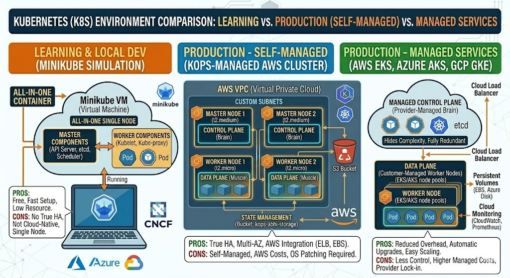
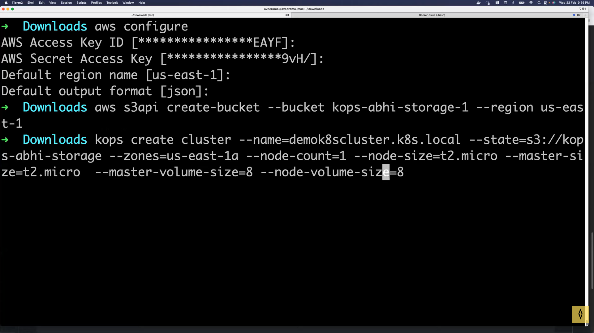

# ☸️ Day 27: Kubernetes Production Systems — Setup & Operations

## 📖 Overview

Today I moved from theory to infrastructure setup. I explored different ways to run Kubernetes—from local learning environments to full-scale production clusters on AWS using **KOPS (Kubernetes Operations)**.

---

## 🏗️ K8s Environment Options

Understanding where to run Kubernetes is crucial. Here is the architectural breakdown of the different environments:



| Level                         | Tools                             | Use Case                                                           |
| :---------------------------- | :-------------------------------- | :----------------------------------------------------------------- |
| **Local/Learning**            | Minikube, Kind, K3d               | Local testing, low resource usage.                                 |
| **On-Prem/Bare Metal**        | Kubeadm                           | Custom control over infrastructure.                                |
| **Cloud Managed**             | EKS (AWS), AKS (Azure), GKE (GCP) | Fast setup, managed by Cloud Provider.                             |
| **Production (Self-Managed)** | **KOPS**                          | Automation of cluster creation, upgrades, and deletion on AWS/GCP. |

---

## Kubernetes Installation Using KOPS on EC2

### Create an EC2 instance or use your personal laptop.

Dependencies required

1. Python3
2. AWS CLI
3. kubectl

### Install dependencies

Add the new Kubernetes repository:

```
sudo apt-get update
sudo apt-get install -y ca-certificates curl apt-transport-https

```

```
curl -fsSL https://pkgs.k8s.io/core:/stable:/v1.28/deb/Release.key | sudo gpg --dearmor -o /etc/apt/keyrings/kubernetes-apt-keyring.gpg

```

```
echo 'deb [signed-by=/etc/apt/keyrings/kubernetes-apt-keyring.gpg] https://pkgs.k8s.io/core:/stable:/v1.28/deb/ /' | sudo tee /etc/apt/sources.list.d/kubernetes.list
```

```
sudo apt-get update
sudo apt-get install -y kubectl

```

Install AWS CLI (Ubuntu 24.04 compatible):

```
sudo snap install aws-cli --classic
```

```
export PATH="$PATH:/home/ubuntu/.local/bin/"
```

### Install KOPS (our hero for today)

```
curl -LO https://github.com/kubernetes/kops/releases/download/$(curl -s https://api.github.com/repos/kubernetes/kops/releases/latest | grep tag_name | cut -d '"' -f 4)/kops-linux-amd64

chmod +x kops-linux-amd64

sudo mv kops-linux-amd64 /usr/local/bin/kops
```

### Provide the below permissions to your IAM user. If you are using the admin user, the below permissions are available by default

1. AmazonEC2FullAccess
2. AmazonS3FullAccess
3. IAMFullAccess
4. AmazonVPCFullAccess

### Set up AWS CLI configuration on your EC2 Instance or Laptop.

Run `aws configure`

## Kubernetes Cluster Installation

Please follow the steps carefully and read each command before executing.

### Create S3 bucket for storing the KOPS objects.

```
aws s3api create-bucket --bucket kops-abhi-storage --region us-east-1
```

### Create the cluster

```
kops create cluster --name=demok8scluster.k8s.local --state=s3://kops-abhi-storage --zones=us-east-1a --node-count=1 --node-size=t2.micro --master-size=t2.micro  --master-volume-size=8 --node-volume-size=8
```



### Important: Edit the configuration as there are multiple resources created which won't fall into the free tier.

```
kops edit cluster myfirstcluster.k8s.local
```

Step 12: Build the cluster

```
kops update cluster demok8scluster.k8s.local --yes --state=s3://kops-abhi-storage
```

This will take a few minutes to create............

After a few mins, run the below command to verify the cluster installation.

```
kops validate cluster demok8scluster.k8s.local
```

---

## 🧠 Key Takeaways: The Cluster Lifecycle

Using KOPS, I learned that a cluster isn't just "created"—it has a lifecycle:

1. **Creation:** Provisioning EC2, VPC, and Control Plane.
2. **Configuration:** Editing cluster specs via `kops edit cluster`.
3. **Upgrades:** Seamlessly updating the cluster version.
4. **Deletion:** Cleaning up all resources to save costs.

---

## ✅ Mastered Concepts

- [x] Difference between Minikube vs. KOPS vs. Managed Services (EKS).
- [x] Installing and configuring AWS CLI & kubectl.
- [x] Setting up IAM permissions for infrastructure automation.
- [x] Managing Cluster State using S3 buckets.
- [x] KOPS Lifecycle: Create, Edit, and Delete.

---

## 🤝 Connect with Me

[](https://www.linkedin.com/in/soham-sarkar-85a5a6247) | [](https://github.com/SohamSarkar025)
