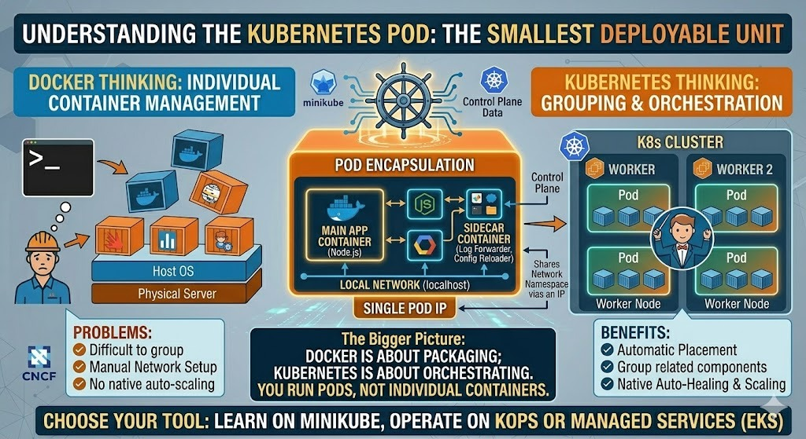
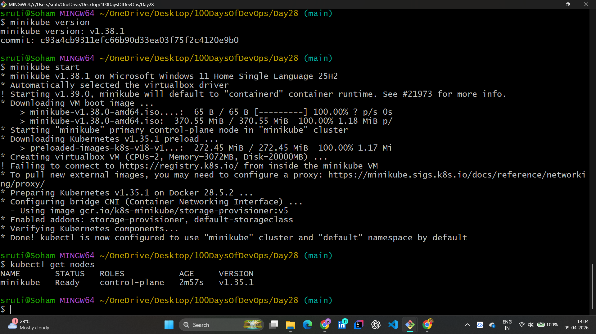
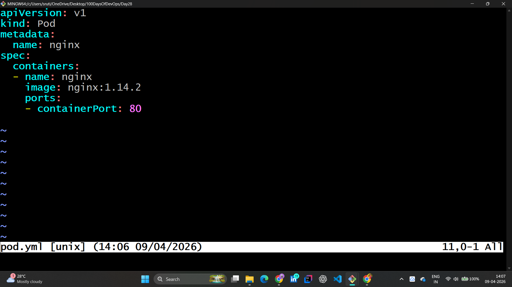
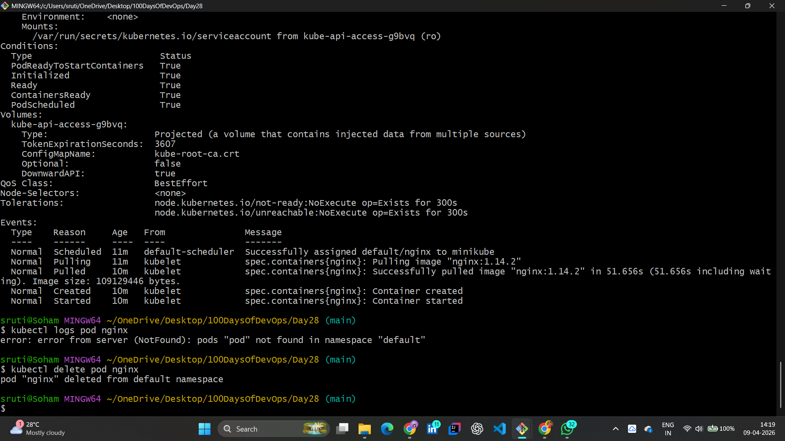
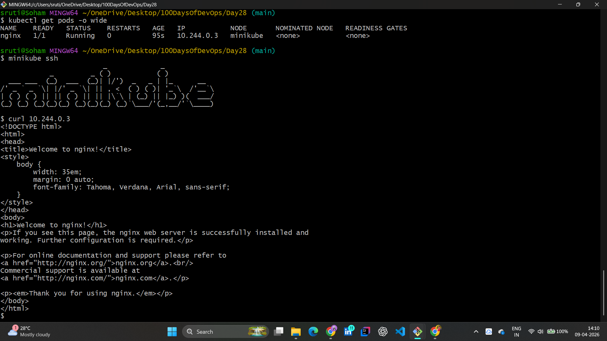

# ☸️ Day 28: Kubernetes Pods — Hands-on Lab & Architecture

## 📖 Overview

Today was a major milestone in my #100DaysOfDevOps journey. I moved from cluster setup to deploying actual workloads. I explored the fundamental unit of Kubernetes: **The Pod**.

---

## 🏗️ What is a Pod?

A Pod is the smallest deployable unit in Kubernetes. It acts as a wrapper around one or more containers, providing a shared environment for networking and storage.

### 💡 Key Differences: Docker vs. K8s

- **Docker:** You manage individual containers (`docker run`).
- **Kubernetes:** You deploy **Pods**. K8s handles the placement, scaling, and self-healing of these Pods automatically.

---

## 🛠️ Practical Lab: Deploying My First Pod

### 1. Cluster Verification

Before deploying, I verified my environment using `kubectl`. My Minikube cluster is up and ready!

### 2. Writing the Pod Manifest (`pod.yml`)

I defined a simple Nginx Pod using YAML. This "Desired State" tells Kubernetes exactly what image to pull and which port to open.

### 3. Deploying and Inspecting the Pod

Using `kubectl apply`, I brought the Pod to life. I used `describe` to see the internal events and lifecycle of the Pod.

**Key Observations from Describe:**

- **Events:** Successfully assigned to node, pulled image, and started container.
- **IP Address:** The Pod was assigned a unique internal IP (`10.244.0.3`).

### 4. Connectivity Test (The "Aha!" Moment)

I used `minikube ssh` to enter the cluster node and performed a `curl` on the Pod's internal IP. The Nginx "Welcome" page confirmed the Pod is running perfectly!

---

## 🔬 Core Concepts Mastered

### 1. The Pod Environment

- **Shared Network:** Containers inside a Pod share the same network namespace (`localhost`).
- **Single IP:** Every Pod gets a unique IP address within the cluster.

### 2. Kubectl Lifecycle Commands

- `kubectl apply -f <file>`: To create/update resources.
- `kubectl get pods -o wide`: To see detailed status and IPs.
- `kubectl describe pod <name>`: For deep troubleshooting and event logs.
- `kubectl delete pod <name>`: To clean up resources.

---

## ✅ Mastered Concepts

- [x] Pod definition and high-level architecture.
- [x] Writing and applying Pod YAML manifests.
- [x] Troubleshooting via `kubectl describe` and `logs`.
- [x] Internal cluster networking and connectivity testing.

---

## 🤝 Connect with Me

 | 
