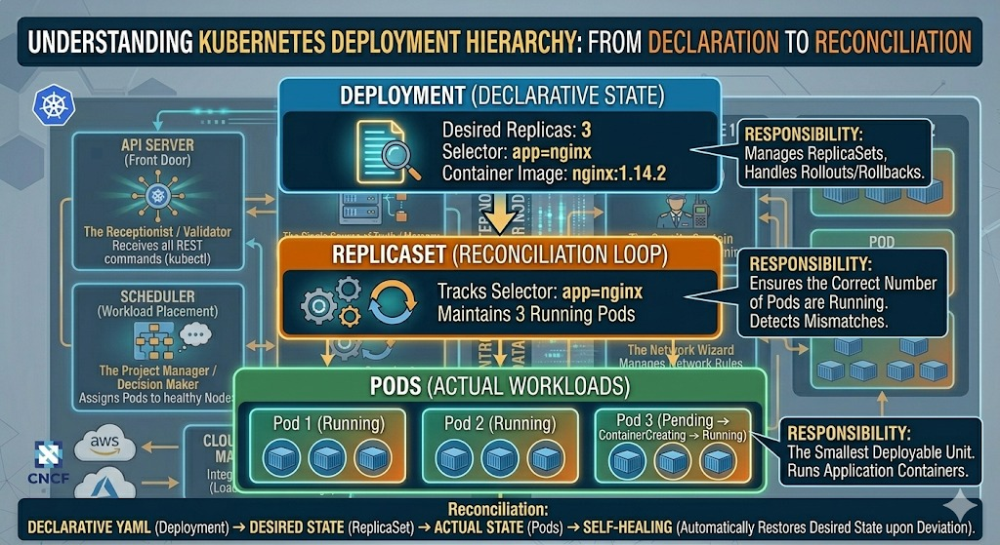
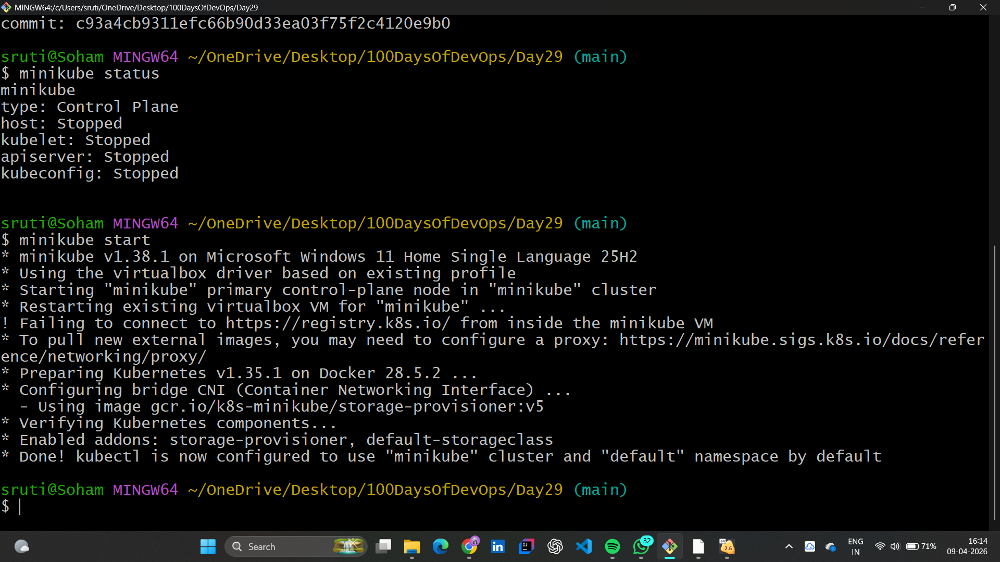
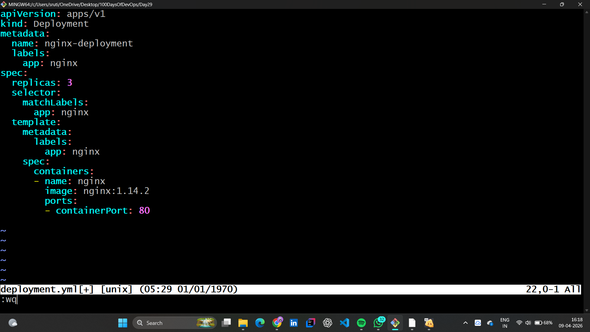
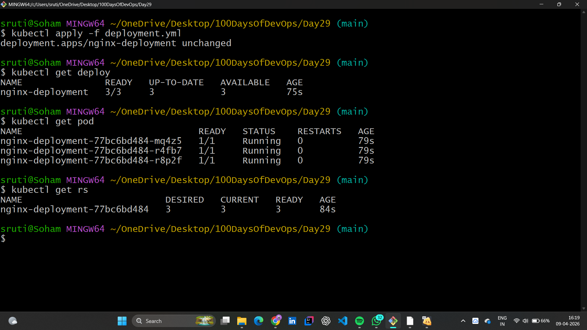
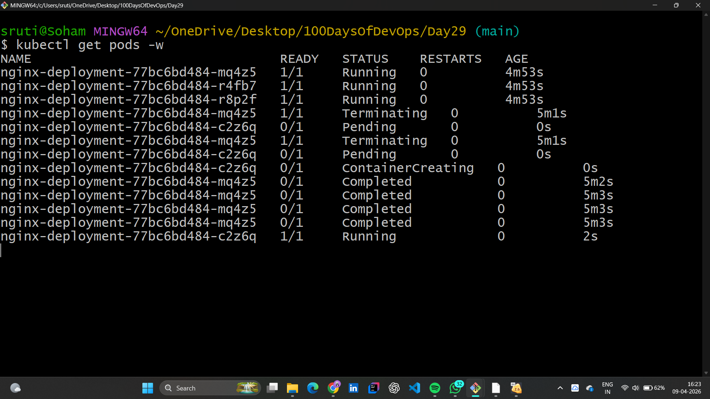
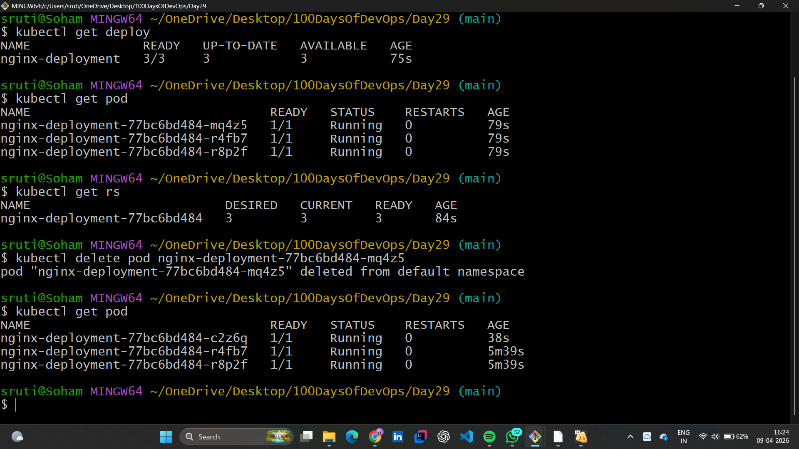

# ☸️ Day 29: Kubernetes Deployments — Mastering Self-Healing & Scaling

## 📖 Overview

Today, I moved beyond individual Pods to explore **Deployments**. This is where the true power of Kubernetes lies—managing replicas, handling updates, and ensuring that our application is always "Up."

---

## 🏗️ The Hierarchy: Deployment > ReplicaSet > Pod

I learned that a Deployment doesn't manage Pods directly. It manages a **ReplicaSet**, which in turn ensures the correct number of Pods are running.

### 💡 Why use Deployments?

- **Self-Healing:** If a Pod dies, the Deployment creates a new one immediately.
- **Scaling:** Want 100 instances? Just change one number in the YAML.
- **Rollouts/Rollbacks:** Seamlessly update app versions with zero downtime.

---

## 🛠️ Practical Lab: Deploying a Scalable App

### 1. Cluster Revival

Started the day by troubleshooting the Minikube connection and getting the cluster back to `Running` state.

### 2. Creating the Deployment Manifest (`deployment.yml`)

I wrote a manifest to maintain **3 replicas** of an Nginx application. Notice the `selector` and `labels` logic—this is how the Deployment tracks its Pods.

### 3. Deploying & Verifying Hierarchy

Applied the manifest and verified how the Deployment created a ReplicaSet, which then spawned 3 Pods.

### 4. The Self-Healing Test (Live Demo)

This was the "Aha!" moment. I manually deleted one Pod, and within seconds, the Deployment detected the mismatch and created a new Pod to maintain the **Desired State** of 3.

---

## 🔬 Core Concepts Mastered

### 1. The Reconciliation Loop

Kubernetes constantly compares the **Actual State** (what is running) with the **Desired State** (what is in the YAML). If there is a gap, it "heals" the cluster.

### 2. Deployment Commands

- `kubectl get deploy`: Check deployment status.
- `kubectl get rs`: View the underlying ReplicaSet.
- `kubectl get pods -w`: Watch Pod transitions in real-time.

---

## ✅ Mastered Concepts

- [x] Difference between Pods vs. Deployments.
- [x] Understanding the role of ReplicaSets.
- [x] Writing `apps/v1` Deployment manifests.
- [x] Observing Self-Healing in action by deleting Pods.
- [x] Using `-w` (watch) flag for real-time monitoring.

---

## 🤝 Connect with Me

 | 
