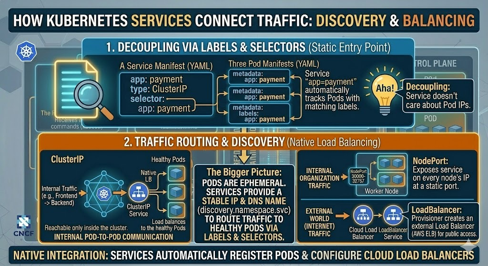

# ☸️ Day 30: Kubernetes Services — Networking & Service Discovery

## 📖 Overview

Pods are ephemeral (temporary). They die and get replaced with new IPs. Today, I learned how **Services** provide a stable IP and DNS name to access these Pods, ensuring our application remains reachable even if Pods restart.

---

## ❓ Why do we need Services?

As seen in my lab, when a Pod dies (Self-healing), the new Pod gets a different IP. If our frontend is talking to a backend via a hardcoded IP, it will break. **Services solve this by providing a permanent entry point.**

---

## 🏗️ The 3 Main Service Types Mastered

### 1. ClusterIP (Internal Only)

- **Use Case:** Communication between Pods (e.g., Frontend to Backend).
- **Access:** Only reachable within the cluster.
- **Diagram Reference:** [Screenshot (345)] - "Inside the Cluster Network".

### 2. NodePort (Internal Organization)

- **Use Case:** Exposing the service on a specific port (30000-32767) of every Node.
- **Access:** Reachable via `<Node-IP>:<NodePort>`. Great for testing within an organization's network.

### 3. LoadBalancer (External World)

- **Use Case:** Production apps on Cloud (AWS/GCP/Azure).
- **Access:** Provisioner creates a Cloud Load Balancer (like AWS ELB) and gives you a Public DNS/IP.
- **Diagram Reference:** [Screenshot (346)] - "Connecting Internet to Worker Nodes".

---

## 🛠️ Practical Lab: Networking & Discovery

### 1. The Logic of Labels & Selectors

I mastered how a Service "finds" its Pods. It doesn't use IPs; it uses **Labels**. If a Pod has the label `app: payment`, the Service with selector `app: payment` will automatically route traffic to it.

---

## 🔬 Core Concepts Mastered

### 1. Static Entry Point

Even if I have 100 Pods scaling up and down, the Service IP (`Payment.default.svc`) remains the same.

### 2. Load Balancing

Services automatically distribute incoming requests across all healthy Pods attached to the selector.

### 3. Native Integration

Learned how Cloud Controller Managers (CCM) integrate with AWS to spin up ELBs automatically when a `type: LoadBalancer` service is created.

---

## ✅ Mastered Concepts

- [x] Why Pod IPs are unreliable for stable communication.
- [x] Service types: ClusterIP vs NodePort vs LoadBalancer.
- [x] Decoupling through Labels & Selectors.
- [x] Service Discovery and internal DNS logic.
- [x] Real-world Cloud integration (EKS/ELB logic).

---

## 🤝 Connect with Me

 | 
