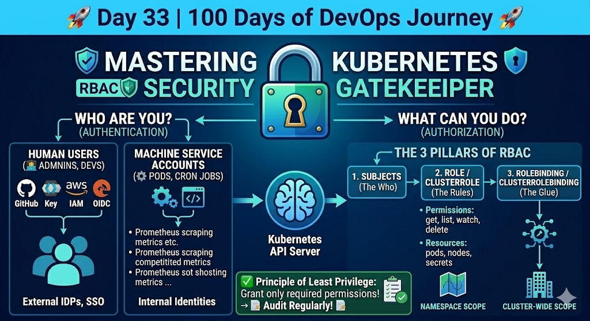

# 🚀 Day 33 — Kubernetes Security: Mastering RBAC 🛡️

100 Days of DevOps Journey — Day 32

## 📌 Overview

Security is paramount in any production cluster. Today’s focus: Role-Based Access Control (RBAC), the mechanism that defines who can do what in the cluster.

---

## 1. What is RBAC? (Simple but Complicated)

RBAC allows you to define and enforce permissions in Kubernetes. It ensures, for example, that a junior developer cannot delete the `kube-system` namespace.

## The RBAC Architecture (Visual Guide)

To understand the complete security flow—from authentication via External IDPs to authorization via Roles—I've mapped out the entire process in this diagram:


_Figure: Deep dive into the K8s Security Gatekeeper - Authentication vs Authorization._

## 2. Users vs Service Accounts

- **Users:** Real humans (admins, developers) authenticated via external systems (IdP, cloud IAM).
- **Service Accounts:** Identities for workloads running inside Pods (e.g., Prometheus scraping metrics).

## 3. The 3 Pillars of RBAC

RBAC requires three components working together:

- **Subjects:** The user or service account that needs access.
- **Role / ClusterRole:** A set of permissions (verbs like `get`, `list`, `watch`, `delete`) for resources.
- **RoleBinding / ClusterRoleBinding:** Binds a Role to Subjects (the glue).

SME Insight: Map Linux user/group concepts to Kubernetes RBAC when designing least-privilege policies for EKS/AKS.

## 4. Enterprise Identity Integration

In production, add central identity management instead of manual user creation:

- **Identity Providers (IdP):** Keycloak, Okta, LDAP
- **Cloud IAM:** AWS IAM (EKS), Azure AD
- **SSO:** OAuth2 / OIDC for streamlined access

## 5. Namespace vs Cluster Scope

- **Role & RoleBinding:** Scoped to a namespace — ideal for team isolation.
- **ClusterRole & ClusterRoleBinding:** Cluster-wide — used for node-level or cross-namespace resources.

Pods access the API server securely via their Service Account tokens; bind minimal permissions required.

## 6. The Relationship Cycle

Subject (User/SA) ➡️ RoleBinding ➡️ Role ➡️ Permissions

---

## 🔐 Key Takeaways

- **Principle of Least Privilege:** Grant only the permissions required.
- **Audit Logs:** RBAC helps trace who did what.
- **API Server Security:** Every `kubectl` action undergoes authentication (who) and authorization (what).

## Example: Minimal Role + RoleBinding

```yaml
# Namespace-scoped Role
apiVersion: rbac.authorization.k8s.io/v1
kind: Role
metadata:
	name: pod-reader
	namespace: example-team
rules:
	- apiGroups: [""]
		resources: ["pods"]
		verbs: ["get", "watch", "list"]

---
# Bind a service account to that Role
apiVersion: rbac.authorization.k8s.io/v1
kind: RoleBinding
metadata:
	name: read-pods-binding
	namespace: example-team
subjects:
	- kind: ServiceAccount
		name: example-sa
		namespace: example-team
roleRef:
	kind: Role
	name: pod-reader
	apiGroup: rbac.authorization.k8s.io
```

---

## References

- Kubernetes RBAC docs: https://kubernetes.io/docs/reference/access-authn-authz/rbac/

---
