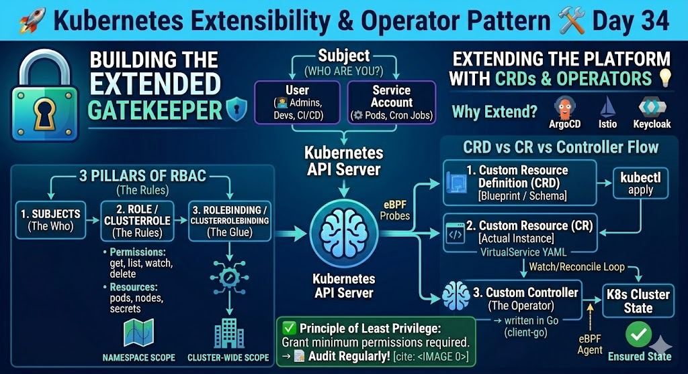

# 🚀 Day 34: Extending Kubernetes – CRDs & Custom Controllers

**100 Days of DevOps Journey — Day 34**

## 📌 Overview

Today was a deep dive into the extensibility of Kubernetes. We learned how to move beyond standard objects (Pods, Services, Deployments) and define custom APIs to automate complex operational tasks.

---

## 🏗️ 1. Why Extend Kubernetes?

Standard Kubernetes objects are great, but for specialised tools like Service Meshes (Istio) or GitOps (ArgoCD), we need more. By extending the Kubernetes API (CRDs + Controllers) we can manage custom, domain-specific resources the same way we manage a Pod or Deployment.

_Figure: How Kubernetes can be extended to support Istio, ArgoCD, and Keycloak._

---

## 🔍 2. The 3 Pillars: CRD, CR, and Controller

- **CRD (CustomResourceDefinition):** The blueprint / schema for a new resource type.
- **CR (CustomResource):** An instance created using that blueprint (a YAML manifest).
- **Custom Controller (Operator):** The background process that watches CRs and reconciles actual cluster state to desired state.

## 🛠️ 3. The Control Loop Logic

Like the Deployment controller manages replicas, a custom controller (often written in Go using `client-go`) watches the API Server for changes to custom resources. It receives events via a Watch, places them into a work queue, and runs a reconcile loop to converge the cluster.

Workflow summary: Watch -> Queue -> Reconcile -> Ensure desired state.

---

## 🔬 4. Native vs. Custom Resource Flow

Standard controllers validate and act on built-in API types. CRDs extend the API surface; custom controllers add the business logic and reconciliation loop to make those CRs actually do work in the cluster.

---

## ✅ 5. The Operator Pattern

A CRD + a Controller = an Operator. Operators encapsulate operational knowledge (backups, upgrades, scaling, config) into software so teams can manage complex apps declaratively via simple YAML manifests.

---

## 🔐 Key Takeaways for SREs

- CRDs are the foundation for tools like ArgoCD and Istio.
- Operators enable declarative automation for complex systems.
- Go + `client-go` knowledge is very valuable for building controllers and operators.

---
