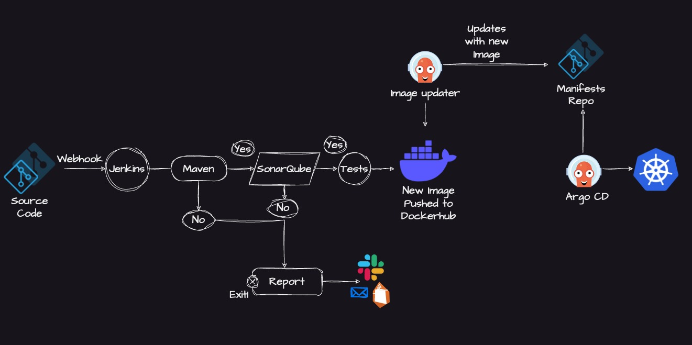

# 🚀 Day 40: Architecting the Ultimate End-to-End CI/CD Pipeline

**100 Days of DevOps Journey — Day 40**

## 📌 Overview

After successfully setting up Jenkins and Docker yesterday, today I zoomed out to design the **Big Picture**. Before writing hundreds of lines of declarative pipelines, an SRE must architect the flow. Today’s focus was designing an enterprise-grade, End-to-End CI/CD pipeline incorporating **Quality Gates (SonarQube)** and **GitOps principles (ArgoCD)** for Kubernetes deployments.

---

## 🏗️ The Ultimate Pipeline Blueprint

This is the final architectural vision. A fully automated workflow where a single code commit triggers a build, runs security checks, containerizes the application, and natively updates a live Kubernetes cluster without any human intervention.

_The Blueprint: Source Code ➡️ Webhook ➡️ Jenkins (Build/SonarQube/Test) ➡️ DockerHub ➡️ Image Updater ➡️ Manifest Repo ➡️ ArgoCD ➡️ Kubernetes._

---

## 🔍 Breaking Down the Architecture (Whiteboard Sessions)

To truly understand the system, I broke it down into three distinct phases: **Continuous Integration (CI)**, **The Bridge (Image Registry)**, and **Continuous Deployment (CD/GitOps)**.

### Phase 1: Continuous Integration (The Jenkins Engine)

The CI phase is entirely responsible for validating the code and packaging it.

.png>)
_Flow: Webhooks trigger a Declarative Jenkinsfile. The pipeline executes Maven builds, runs Unit Tests, and performs SAST (Static Application Security Testing)._

.png>)
_Quality Gates: If SonarQube detects vulnerabilities, the build fails and Slack/Email notifications are sent. If it passes, the Docker Image is built._

---

### Phase 2: The Handoff (Code to Infrastructure)

Once the CI pipeline creates the Docker Image, it needs to be handed over to the deployment phase. We **never** deploy directly from Jenkins to Kubernetes. Instead, we use an intermediary strategy.

.png>)
_Versioning: The Docker image is tagged (e.g., `v1.0.1`) and pushed to a registry. This new tag must now be updated in our Kubernetes deployment manifests._

.png>)
_The Bridge: Pushing to ECR/DockerHub/Quay triggers an Image Updater, which edits the `deployment.yaml` in a separate Manifests Git Repository._

---

### Phase 3: Continuous Deployment (GitOps via ArgoCD)

The most secure way to deploy to Kubernetes is using the **GitOps pull model**. Instead of Jenkins pushing to the cluster, tools like ArgoCD sit inside the cluster and monitor the Manifest Repository.

.png>)
_GitOps Repository: A dedicated repository containing `pod.yaml`, `deploy.yaml`, and `service.yaml` (or Helm Charts). ArgoCD constantly watches this repo._

.png>)
_The Pull Model: When the Image Updater commits the new tag to the Manifest repo, ArgoCD detects the drift and automatically pulls the new state into the Kubernetes cluster._

---

## ✅ Key Takeaways for SREs

1. **Separation of Concerns:** Keep your application source code repository and your Kubernetes manifest repository strictly separate.
2. **Push vs. Pull:** Standard CI/CD pushes code to servers. Modern Kubernetes CD (GitOps) uses ArgoCD to _pull_ configurations, drastically improving cluster security (Jenkins doesn't need cluster admin credentials).
3. **Quality Gates are Mandatory:** A pipeline without SonarQube or SAST is just automating bad code faster. Security must shift-left.

---
