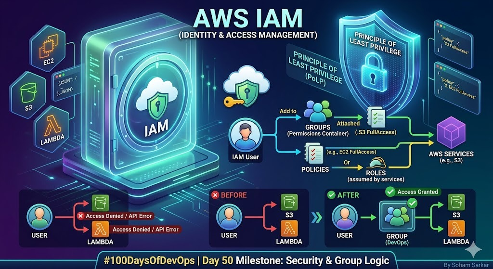

# Day 50: AWS IAM (Identity & Access Management) – Security & Group Logic 🔐🛡️

**"Authentication confirms identity; Authorization defines limits."**

Today is a massive milestone—**Day 50 of 100!** 🚀 Having mastered the core pillars of local infrastructure, I am now deep-diving into the security backbone of the AWS Cloud. Today’s lab focused on the **Principle of Least Privilege (PoLP)** and scaling permissions using **IAM User Groups**.

---

## 🌟 Milestone Infographic: IAM Workflow Summary

## 🏗️ 1. Core Components of IAM

IAM allows us to manage access by creating four primary entities:

1. **Users:** Individual identities for people or services.
2. **Groups:** Collections of users that share the same permissions.
3. **Policies:** JSON documents defining allowed/denied actions.
4. **Roles:** Temporary credentials for AWS services or cross-account access.

.png>)

---

## 🛠️ 2. Practical Lab: Building a Secure Identity Flow

### Phase 1: Creating a Restricted User

I created `test-user-100` with **AmazonEC2FullAccess**. At this stage, the user can manage servers but is blocked from everything else.

.png>)
.png>)

### Phase 2: Testing Authorization Boundaries

Login was successful, but the real test began when trying to access unauthorized services.

- **The Barrier:** When navigating to **AWS Lambda** or **S3**, the console displayed strict `Access Denied` and `API Error` messages.
- **The Logic:** Since no policy allowed these actions, IAM's default behavior is an **Implicit Deny**.

.png>)
.png>)

---

## 👥 3. Scaling with IAM User Groups

Instead of manually adding permissions to every user, we use **Groups**. This makes infrastructure management scalable and less prone to errors.

### Step 1: Create a "devops" Group

I initiated the creation of a new user group named `devops`.

.png>)

### Step 2: Adding Users & Attaching Policies

I added `test-user-100` to the group and attached the **AmazonS3FullAccess** policy to the group itself.

.png>)

### Step 3: Verifying the Group Policy

The group was successfully created with the defined permissions, acting as a "Permission Container" for any user added to it.

.png>)

---

## ✅ 4. Final Verification: Access Granted

After adding the user to the `devops` group, I checked the user's permission summary. You can see the permissions are now a mix of **Direct** (EC2) and **Group-based** (S3).

.png>)

**Success!** Navigating back to the S3 console, the errors disappeared, and I could finally access the S3 resources.

.png>)

---

## 💡 Key Takeaway

"IAM Groups simplify the lifecycle of permissions. Instead of managing 100 users, you manage 5 groups. This lab proved that IAM is the ultimate gatekeeper of the AWS Cloud."

---
